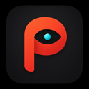
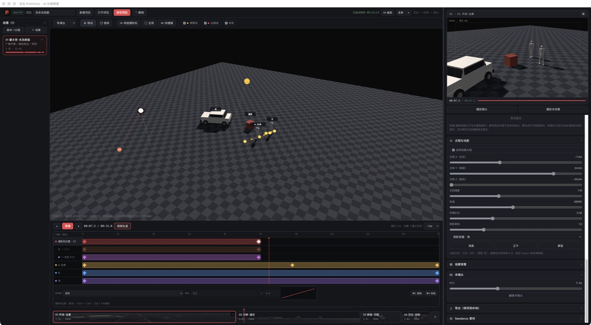

<p align="center">
  
</p>

<h1 align="center">预见 PreVision</h1>

<p align="center">
  面向 AI 影视创作者的三维导演台：先把调度、机位、运镜和光影设计清楚，再进入生成环节。
</p>

<p align="center">
  
  
  
</p>



> 当前版本是 **v0.7.2 Preview**。核心创作流程已经可用，仍在快速迭代，欢迎导演、分镜师、摄影师和 AI 视频创作者参与测试。

## 为什么做预见

AI 视频工具擅长“生成画面”，但复杂镜头仍然需要提前回答很多导演问题：角色什么时候开始移动？摄影机从哪里出发？中途经过哪些机位？速度怎样变化？镜头是否始终看向主体？多人、多道具、多条路径怎样在同一时间轴上配合？

预见把这些抽象描述变成可视、可拖动、可预演的三维场景，让创作者专注于镜头设计，而不是手工计算坐标和时间。

## v0.7 核心亮点

### 三维导演台

- 在场景中放置人物、马匹、车辆、道具、树木、房屋、山体等元素。
- 自由巡视、旋转和平移场景，快速切换全局视角与摄影机视角。
- 角色与道具支持高度调整、一键贴地、接触与基础防穿透。
- 支持人物骑乘马匹，并让组合对象沿调度路径运动。

### 多轨调度时间轴

- 摄影机、角色和道具各自拥有独立运动轨道。
- 彩色运动条可以整体平移，关键帧可以逐点拖动。
- 支持多选、复制、粘贴、删除，以及 `⌘Z` 连续撤销。
- 可设置匀速、缓入缓出和贝塞尔速度曲线，并预览速度变化。
- 可选择独立时间、节点同步或按对象建立同步关系。

### 摄影机与运镜设计

- 摄影机位置、朝向与焦距可以逐关键帧记录和调整。
- 支持直线或平滑曲线路径，并在点位之间自动插值。
- 点击机位点即可快速查看该点画面，无需完整预演。
- 支持跟拍、推近、拉远、横移、升降、环绕等运镜预设。
- 可复制角色或道具的移动路线，快速生成邻近运镜路径。

### 灯光、阴影与场景参考

- 太阳方向、方位、高度、强度、色温和阴影柔和度可调。
- 场景元素投射实时阴影，便于判断光位和画面层次。
- 支持背景参考板与全景背景，用于建立构图和空间参照。

### 预览与输出

- 右侧摄影机监看画面实时更新。
- 支持镜头预演、整场景预演、应用内截图和录屏。
- 可导出项目数据与面向 AI 视频工作流的镜头参考素材。
- 项目自动保存在本地，不依赖云端账号。

更完整的功能说明见 [功能清单](docs/FEATURES.md)，后续计划见 [开发路线图](docs/ROADMAP.md)。

## 快速开始

### 方式一：直接打开网页版本

下载项目后，双击 `预见PreVision.html`。项目已经内置必要的前端依赖，日常使用不需要联网。

### 方式二：运行 macOS 桌面开发版

需要安装 [Node.js 22](https://nodejs.org/) 或兼容版本。

```bash
npm ci
npm start
```

Bug、新功能、UI/交互或其他用户可见优化完成后，先提交代码并关闭所有 PreVision 窗口，再运行：

```bash
npm run app:deliver
```

该命令会执行完整回归、确认当前分支包含固定 App 的上次来源、构建、安装并自动打开。固定入口为 `~/Applications/PreVision.app`。用 `npm run app:status` 可核对安装来源；落后的兄弟分支会被拒绝，必须先整合最新交付提交。安装成功后会删除本次 `out/` 中可再生成的 App，失败时保留产物供诊断。单独运行 `npm run package` 不代表已经交付。

### 固定局域网最新预览（开发者）

macOS 用户可安装独立的用户级 LaunchAgent，把既有“最新预览”指针对应的 Web 构建提供给同一可信物理局域网中的浏览器：

```bash
npm run preview:lan:install
npm run preview:lan:status
```

服务固定使用 `4174`，首选地址为 `http://<本机LocalHostName>.local:4174/`，并提供当前私有 IPv4 fallback。它只绑定默认物理 LAN 的精确私有地址，拒绝任意 Host、其他子网、VPN/Tailscale/`utun*`、目录遍历和清单外文件；不会改变原 `web:preview` 的 `127.0.0.1` 合同。

```bash
npm run preview:lan:start
npm run preview:lan:stop
npm run preview:lan:restart
npm run preview:lan:uninstall
```

该入口不提供账号、设备同步、协作或公网发布。每台设备的 localStorage 和项目数据完全独立；HTTP 只适合受信任的私有 LAN。完整边界见 [静态 Web 运行底座](docs/WEB_RUNTIME.md)。

快速确认应用能启动：

```bash
npm test
```

提交改动前运行完整回归：

```bash
npm run test:full
```

也可以用 `npm run test:impact -- --base main` 根据改动文件选择最小测试范围。
主应用单体 HTML 内能明确归属的改动，可按 `qa/test-impact-map.yaml` 使用 `npm run test:impact -- --base main --module camera` 等模块范围。

构建 Apple Silicon 版 macOS 应用：

```bash
npm run make:mac
```

> 当前只重点维护 macOS。Windows 版本将在核心交互稳定后继续推进。

## 如何反馈

不需要会写代码。只要你能描述“做了什么、期待什么、实际发生了什么”，就已经非常有帮助。

- [报告 Bug](../../issues/new?template=bug_report.yml)
- [提出功能建议](../../issues/new?template=feature_request.yml)
- 参与开发前请阅读 [贡献指南](CONTRIBUTING.md)
- 参与社区交流请遵守 [社区行为规范](CODE_OF_CONDUCT.md)

提交问题时，最好附上截图或短视频、复现步骤、macOS 版本，以及不含隐私信息的项目文件。请不要在公开 Issue 中上传未公开剧本、账号信息或商业素材。

## 项目结构

```text
预见PreVision.html      主应用与三维编辑器
electron/              macOS 桌面外壳
assets/                应用图标与静态资源
vendor/                离线运行所需的第三方前端依赖
测试/                   自动化测试
scripts/                本机构建与固定 App 更新脚本
docs/                  公开文档、截图与路线图
```

## 当前边界

- v0.7 仍是预览版，不建议把唯一项目副本只保存在应用中。
- 场景碰撞、人体姿态和真实物理目前用于镜头预演，不等同于专业物理仿真。
- 应用输出用于辅助 AI 视频生成，不能保证不同模型得到完全一致的结果。

## 许可证

首次公开发布前会确定项目许可证。在仓库加入明确的 `LICENSE` 文件以前，源代码默认保留全部权利，不构成开源授权。

第三方组件及其许可证见 [THIRD_PARTY_NOTICES.md](THIRD_PARTY_NOTICES.md)。
“预见 / PreVision”名称与应用图标的使用边界见 [名称与图标使用说明](TRADEMARKS.md)。
