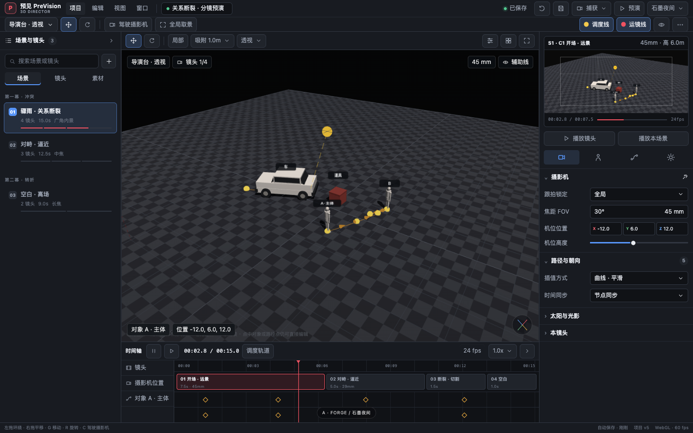
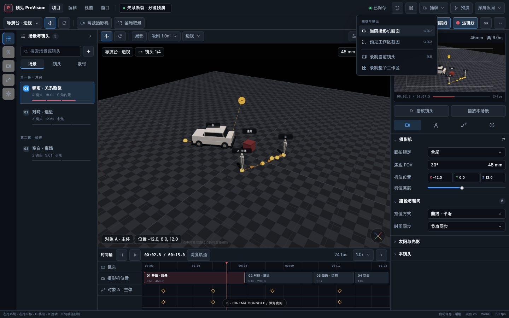
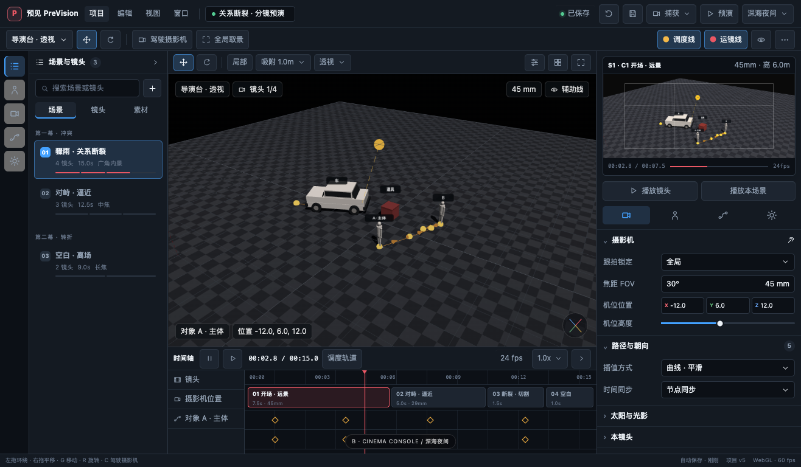
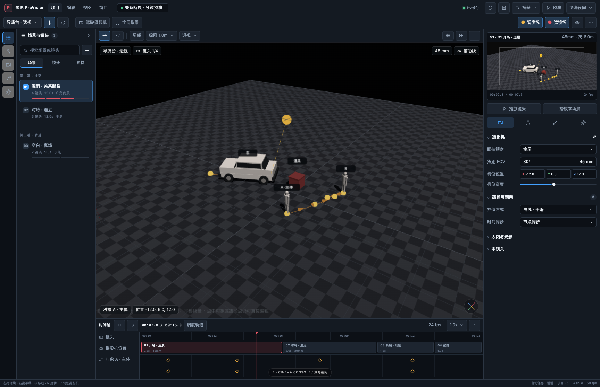
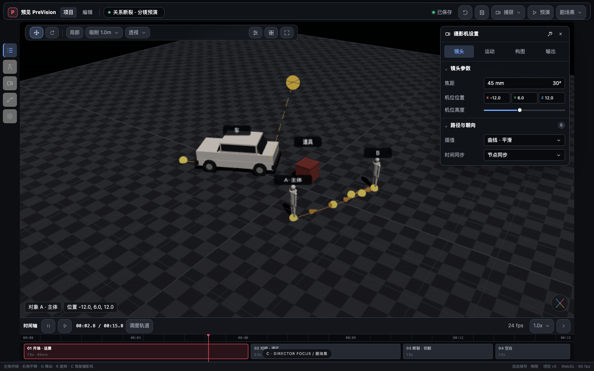
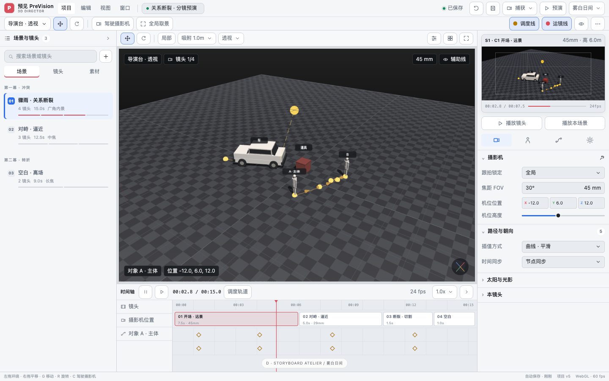
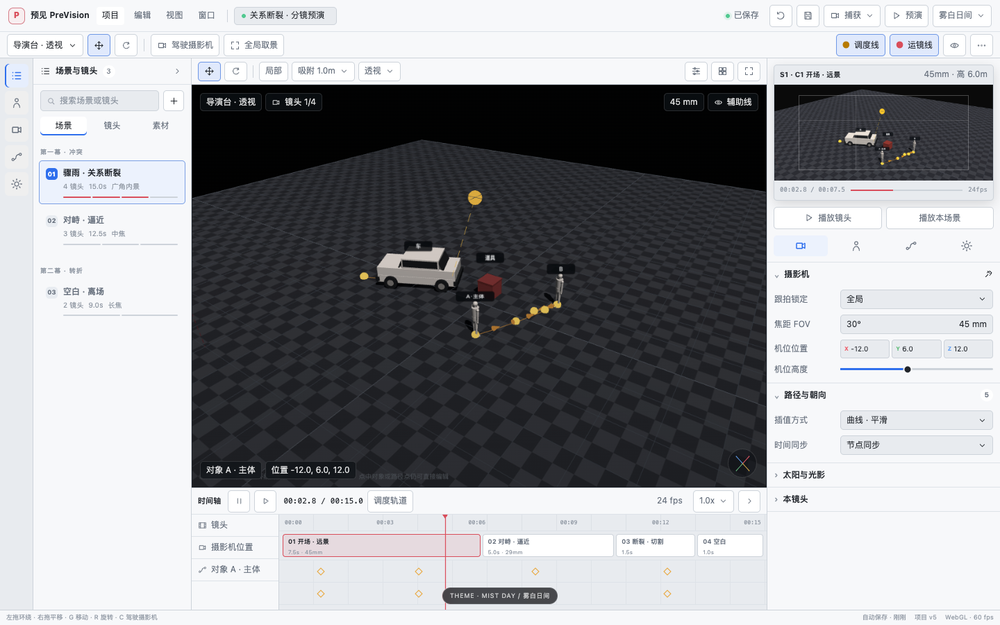
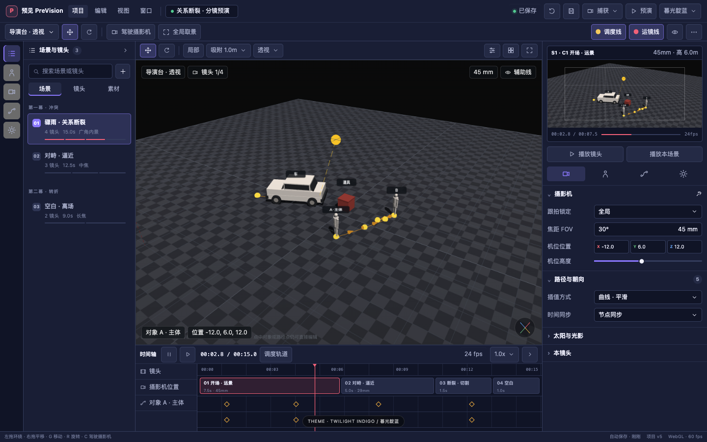
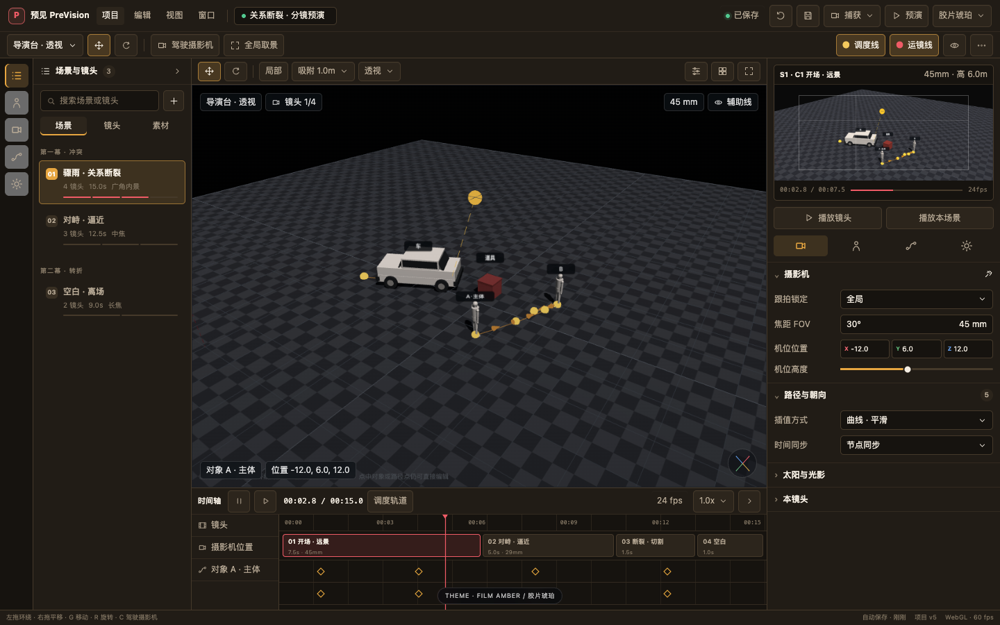

# PreVision UI 风格方向提案

- 日期：2026-07-13
- 基线：`02cf401`
- 目标主稿：1440×900
兼容检查：1316×768、1728×1117

本目录是界面大改前的独立视觉与交互提案，不是生产界面。`预见PreVision.html`、Electron 逻辑和项目数据格式均未修改。

## 结论先行

推荐以 **B「电影控制台」** 作为桌面主结构，吸收 **C「导演专注台」** 的窄屏/专注模式，再使用一套语义化主题令牌提供雾白日间、石墨/深海夜间、暮光靛蓝和胶片琥珀外观。

原因：B 在专业密度、功能发现性和中央视口面积之间最均衡；C 适合作为 13–14 英寸 MacBook 的折叠态，而不适合作为唯一常驻布局。

## 四套布局方向

### A · Forge / 精密锻造台



- 气质：克制、工业、精密，接近专业 DCC 的高信息密度。
- 1440×900 默认尺寸：顶栏 66px、左栏 252px、右栏 320px、时间轴 168px。
- 状态：左右栏常驻展开，时间轴展开；分隔线可拖拽，栏标题保留折叠入口。
- 图标：16px、1.5–1.7px 描边、局部填充表示激活；普通图标不使用多色。
- 优点：空间效率和长期扩展性最好。
- 风险：初次使用偏硬核；若一步到位实现任意拆分/停靠，开发成本与回归风险最高。

### B · Cinema Console / 电影控制台（推荐）



- 气质：现代、沉浸、制作现场感，强调“全局命令 → 视口上下文 → 当前对象属性”的三级层次。
- 1440×900 默认尺寸：全局栏 46px、上下文栏 38px、左侧模式轨 48px + 内容区 228px、右栏 336px、时间轴 176px。
- 状态：模式轨常驻；内容区可临时打开或固定；示意图展示捕获二级菜单。
- 菜单：左图标、中标签、右快捷键；同层只保留一个强调动作；“品牌色、选中蓝、轨迹黄、危险红”分工。
- 优点：专业感、可理解性与实现可控性最均衡。
- 风险：抽屉状态必须统一，否则会增加无意义点击；两层顶栏必须持续克制。

目标尺寸检查：





### C · Director Focus / 导演专注台



- 气质：电影化、安静、视口优先，面向预演、演示和窄屏。
- 1440×900 默认尺寸：顶部浮动命令栏 48px、左右模式轨各 48px、底部胶片条 108px、临时属性抽屉 314px。
- 状态：左右内容默认收为图标轨；点击后临时覆盖，固定后才占用布局；胶片条可拉高进入完整多轨时间轴。
- 优点：中央画面最大，13–14 英寸屏幕体验最好。
- 风险：功能发现性较弱；不适合长时间同时比较多个属性面板。

### D · Storyboard Atelier / 分镜编辑台



- 气质：清晰、编辑化、偏导演与分镜工作流；日间环境可读性最好。
- 1440×900 默认尺寸：顶栏 72px、左栏 276px、右栏 312px、时间轴 208px。
- 状态：左右栏稳定停靠，可收为 40px 轨道；时间轴有胶片条/完整时间轴两档。
- 优点：场景、镜头和时间信息最易理解。
- 风险：工程参数密度低于 A；留白失控时会削弱专业工具感。

## 同一结构上的主题体系

主题只替换应用 Chrome 的语义令牌，不改变三维场景材质、摄影机输出、路径颜色语义或项目文件。以下三张图均使用 B 的同一布局：

### 雾白日间



### 暮光靛蓝



### 胶片琥珀



建议首发主题：

| 主题 | 主表面 | 面板 | 焦点/选择 | 适用场景 |
| --- | --- | --- | --- | --- |
| 雾白日间 | `#E8EBEF` | `#F7F8FA` | `#2F6FED` | 明亮办公室、白天长时间阅读 |
| 石墨夜间 | `#0F1217` | `#181C23` | `#5794F7` | 默认专业工作环境 |
| 暮光靛蓝 | `#101426` | `#191E35` | `#8B78FF` | 预演、演示、低照度环境 |
| 胶片琥珀 | `#16130F` | `#211C16` | `#E7A640` | 温暖电影制作氛围 |

共同令牌至少包括：

- `surface.canvas / panel / raised / overlay`
- `border.subtle / strong`
- `text.primary / secondary / disabled`
- `icon.default / active`
- `brand / focus-selection / trajectory / warning / danger / success`
- `grid.major / minor / shadow`

日间主题不能简单反色。所有主题需分别校准边框、阴影、禁用态、焦点态和菜单浮层；普通文本目标对比度至少 4.5:1，焦点状态不能只靠颜色表达。

## 菜单与图标规则

### 菜单层级

1. macOS 原生菜单继续保留“预见 PreVision / 文件 / 编辑 / 显示 / 窗口”，承担系统级打开、保存和窗口命令。
2. 页面全局栏只放项目状态、保存、预演、捕获、主题等高频全局命令。
3. 视口工具栏只放移动、旋转、驾驶摄影机、吸附、视图和辅助线等当前视口动作。
4. 场景、镜头、对象和路径的次级动作进入右键菜单或对象行尾菜单。
5. 二级菜单行高 30–32px，左侧 16px 图标，中间标签，右侧快捷键或子菜单箭头；Escape 与外点关闭，同一时刻只打开一个菜单。

### 图标体系

- 统一使用项目自有的几何描边图标，不再混用 Emoji、Unicode 符号和不同风格 SVG。
- 基础网格 16px；模式入口 18px；极少数主动作 20px；标准描边 1.5px。
- 最小可点击区：紧凑模式 28px，标准模式 32px，模式轨 36px。
- 高频主动作使用“图标 + 短文本”；次级动作可只显示图标，但必须有 tooltip 和可访问名称。
- 品牌珊瑚红不再同时承担选择与危险语义：选择用蓝/紫，路径用黄，录制/危险用红。

## 边栏与时间轴状态机

所有主要区域采用一致状态，而不是每栏各自发明一套交互：

| 状态 | 行为 | 是否占用布局 | 持久化 |
| --- | --- | --- | --- |
| 展开并固定 | 常驻内容，可拖宽 | 是 | 是 |
| 紧凑轨道 | 仅保留 40–48px 模式图标 | 是 | 是 |
| 临时抽屉 | 从轨道打开，覆盖视口边缘 | 否 | 否 |
| 隐藏/专注 | 只在专注模式使用 | 否 | 可选 |

具体规则：

- 单击模式轨：打开临时抽屉；点击图钉：转为固定栏；再次点击当前模式：收回轨道。
- 拖拽 6–8px 分隔区调整宽高；双击恢复推荐尺寸；拖动时实时显示尺寸提示。
- Escape 先关闭菜单和临时抽屉，再执行现有的取消选择语义。
- 右栏保留“展开前宽度”；窗口变小时重新钳制，变大后恢复合理值。
- 时间轴支持隐藏、胶片条、完整多轨三态；视觉折叠不得重建或清空关键帧数据。
- 布局与主题只写新的本机 UI 偏好键，不进入项目 v5，不触发项目 dirty/undo，也不能清理 `previz_autosave_v3`。

## 尺寸建议

| 内容尺寸 | 左栏 | 右栏 | 时间轴 | 中央视口原则 |
| --- | --- | --- | --- | --- |
| 1316×768 | 默认轨道 48px；固定 228–248px | 300px，必要时临时抽屉 | 胶片条 112–132px；完整约 220px | 最坏状态不低于约 680px 宽；顶栏进入紧凑态 |
| 1440×900 | B 默认 276px（含模式轨） | 336px | 176px，可拉至约 288px | 默认约 828px 宽，作为主设计稿 |
| 1728×1117 | 276–300px | 336–380px | 190–300px | 多余空间优先归视口，不让边栏无节制变宽 |

实现时仍需保留当前 Electron 最小窗口 1100×700 的安全降级：左右栏至少一侧进入轨道，时间轴使用胶片条，所有命令仍可通过菜单或快捷键到达。

## 从 Blender 与 Unreal Editor 借鉴的结构规律

- Blender 的 Area 以矩形编辑区组织功能，支持拖边调整、拆分/合并、最大化和专注；Panel 支持折叠、重排与固定。PreVision 首轮只借鉴“区域边界、三态面板、专注视口”，不直接实现任意拆分编辑器，以控制单文件架构风险。
- Unreal Editor 把主工具栏与视口工具栏分层；Content Drawer 可临时打开，也可固定进布局；Outliner 选择与 Details 面板同步，Details 还能锁定当前对象。PreVision 可直接借鉴“临时/固定抽屉”和“选择同步/属性锁定”模式。

参考：

- [Blender Manual — Areas](https://docs.blender.org/manual/en/latest/interface/window_system/areas.html)
- [Blender Manual — Tabs & Panels](https://docs.blender.org/manual/en/latest/interface/window_system/tabs_panels.html)
- [Unreal Engine — Unreal Editor Interface](https://dev.epicgames.com/documentation/en-us/unreal-engine/unreal-editor-interface)

## 实现边界与建议顺序

1. 先建立主题令牌、焦点语义和统一 SVG 图标壳，不改变 DOM ID 与业务事件。
2. 再重排全局栏、视口工具栏和菜单层级，保护截图/录屏与 Electron 双入口。
3. 实现左右栏“固定/轨道/临时抽屉”状态机，每个过渡都触发 renderer resize。
4. 最后调整时间轴尺寸和三态，补齐坐标映射、关键帧状态和项目数据不变性测试。
5. 每阶段单独验收；跨 `layout/capture/camera/viewport/timeline/project` 时运行完整应用或全量回归。

尤其不能破坏：

- 主视口 `viewCam.aspect` 与 renderer 尺寸同步。
- 监视器保持项目画幅，不受右栏宽度污染。
- 时间轴 scrub 与镜头块真实几何映射。
- 射线拾取使用 canvas 实际矩形。
- 折叠/主题切换不改变摄影机、对象路径、镜头时间或项目 JSON。

## 查看与复现

`index.html` 是完全离线的独立设计稿，可用查询参数切换：

```text
index.html?style=forge
index.html?style=cinema&state=menu
index.html?style=focus
index.html?style=atelier
index.html?style=cinema&theme=mist
index.html?style=cinema&theme=twilight
index.html?style=cinema&theme=amber
```

所有截图均由该文件在本地 Chrome 中确定性渲染；当前真实界面截图仅作为中央三维场景的结构参考。
