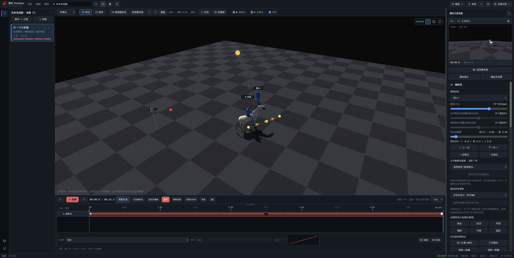

# 01.17｜摄影机 FOV 锁定与时间线一致性 QA

状态：产品实现与定向自动验证已完成；独立 R2 首轮结论为 BLOCK（P0/P1 none，P2 Chrome/LAN 证据不足，P3 DOM probe timeline fixture 缺少必要性说明）。本轮只返修证据、文档与测试夹具说明，未修改产品代码。固定 App、稳定 4174 指针、GitHub 和 Pages 均未修改。

## 修复合同

- FOV 的显示、写入和运行采样不再依赖 yaw/pitch 控件的 `disabled` 状态；yaw/pitch 仍只允许 manual lock 修改。
- committed key 编辑同步当前 `camKey.fov` 与兼容标量 `shot.fov`；非 key 且 AutoKey off 只进入既有 transient draft。
- actor/global/manual × custom/pointSync/arcLength 的基础点、普通 key、draft、point preview、播放和自动 capture 共用当前 key、插值或 draft FOV。
- capture gate 在任何 authored/draft/runtime/project/history/autosave 写入前拒绝 FOV input。

## RED → GREEN

首笔执行级 RED 使用实际 FOV `input`/`change`，actor lock + custom + t=0：

- expected：`{ui:79, shot:79, camKey:79, shotCam:79, monitor:15mm}`
- baseline actual：`{"inputResult":true,"uiValue":79,"label":"79°(约15mm)","shotFov":79,"camKeyFov":40,"shotCamFov":40,"monitor":"33mm · 高2.0m"}`
- 产品修复后的真实 Chrome 复核又识别出 monitor 即时刷新遗漏；去除测试中的手工 runtime 刷新后，RED actual 为 `shotCam=79`、monitor 仍 `33mm`。FOV handler 同步运行摄影机与 monitor 后，camera 为 111/0。

## 真实 Chrome/LAN

- 证据等级：`PARTIAL_EVIDENCE`，不是完整可审计 PASS。
- 冻结产品提交：`9663ee982524973d2c6b39912e43800b22241e63`；Git tree：`66f7b06ab59046dbae305b71bd7c5014164d6823`。
- 实际 Web build/source：`预见PreVision.html`；Git blob：`191a9acbf0d1a06f2df50fe7edccc0856c8a09da`；SHA-256：`60c4b3d213b162593fc4a9bea50b0b4ce579a6cb1117cb612d933e2bfd0a3cd9`。截图本身没有内嵌 commit/hash；这里记录的是人工验证会话所用冻结 build 与提交内容的字节绑定，不把截图包装成内生的密码学证明。
- Chrome：Google Chrome 150.0.7871.187，扩展控制的真实 Chrome；不是 Electron Chromium。
- URL：`http://192.168.1.122:4187/director/?qa=0117-green`
- 来源：任务分支 `fix/01.17-camera-fov-lock-timeline-consistency`，baseline `37c8cd8d81626b81232a2ab5f774326811602532`，冻结产品提交 `9663ee9…` 的隔离 Web build。
- CSS viewport：2560×1288。
- 隔离边界：Python 静态服务只绑定 `192.168.1.122:4187`；稳定 4174 服务与 pointer 未改。
- 当前截图可独立展示：actor lock=男人1、custom/t=0、FOV `79°(约15mm)`、monitor `15mm · 高2.4m` 与变更后构图；截图 SHA-256 为 `7509fd2936b0533fd28e60901309e549dcdf8c500ac30d033f69bd52377e9394`。
- 此前人工观察但本证据未独立展示/未验证：原生 range 的 39→79 输入过程、构图前后对照（只保留了记录的裁片 hash，没有成对图像）、0.9 秒 playback、point preview 开/关、save/reopen、global/manual、pointSync/arcLength。
- console 状态：此前会话记录为 warning/error 0；当前截图没有展示 DevTools/console，且隔离 4187 会话已结束，无法独立复核，因此不把 console 0 当作当前证据独立展示的 PASS。
- 返修时检查现有真实 Chrome 会话，只发现稳定 `192.168.1.200:4174/director/`；按禁令未接管、未操作，也没有为补证重启 4187。

## 自动验证

Node：v24.18.0。

| 命令 | 结果 |
| --- | --- |
| `npm run build` | PASS |
| `npm run test:module -- camera` | 111/0 |
| `npm run test:module -- timeline` | 209/0 |
| `npm run test:module -- playback` | 42/0 |
| `npm run test:module -- history` | 29/0 |
| `npm run test:module -- project` | 121/0 |
| `npm run test:module -- capture` | 163/0 |
| `npm run test:project-input` | PASS；Web/Electron 两路都是真实 Electron Chromium native range，不冒充独立 Chrome |
| `npm run test:i18n` | 217/0 |
| `npm run test:foundation` | 151/0；C8 11/0、coordination 553/0、i18n 217/0、project-input wrapper 11/0 |
| `npm run test:impact -- --base 37c8cd8d81626b81232a2ab5f774326811602532 --module camera` | 返回 1：camera 111/0、playback 42/0、timeline 209/0 后，`test:app` 为 1187/2；精确 baseline 同命令的 `test:app` 为 1186/2，失败集合完全相同（树木提示词指代、无 modal 快捷键恢复），不包装为 PASS |
| `npm run test:web` | 25/0；impact 因历史失败未执行到，已单独补跑 |
| `git diff --check` | PASS |

impact 未继续执行到 foundation、project-input 与 web；三项均已在任务分支单独通过。没有主动运行 full，按合同留给 `00` 在集成阶段决定。

### R2 BLOCK 后最小返修重跑

| 命令 | 结果 |
| --- | --- |
| Node 24 `npm run build` | PASS；Web 入口 SHA-256 仍为 `60c4b3…a3cd9` |
| Node 24 `npm run test:module -- camera` | 111/0 |
| Node 24 `npm run test:project-input` | PASS；恢复必要 timeline fixture 后，FOV native range 与 timeline hit-test 均完成 |
| Node 24 `npm run test:foundation` | PASS；仓库基础 151/0、C8 11/0 及后续门禁退出码 0 |
| `git diff --check` | PASS |
| impact / full | 未运行；遵守 R2 返修禁令 |

## DOM probe timeline fixture 必要性

`测试/项目输入DOM探针.cjs` 新增的 FOV 原生 range 路径与既有 `timelineHitProbe` 共处同一个 `test:project-input` 进程。R2 返修中曾删回 timeline fixture、选择器与拖动方向改动：Web/Electron 两路 FOV range 都先通过，但随后 `timelineHitProbe` 明确失败为 `timeline fixture did not create every target`，命令返回 1。

因此保留的测试侧改动只用于让既有 hit-test fixture 确定性成立：显式建立 actor path/time，切到 actor 时间范围；用 `:not(.foundation)` 排除 0 秒基础 key；用唯一 actor label 将 clip 限定到目标行；拖动方向避开时间轴边界。它不改变产品代码、FOV 业务语义或时间轴数据格式。

## 证明边界

- 当前证据只证明任务 Worktree 的隔离 Web build；不代表已中央集成、已更新稳定 LAN、已交付固定 App 或已公开发布。
- 当前截图只能独立证明它画面内可见的 actor/custom/t=0 最终 79°状态；其余 Chrome/LAN 人工观察均明确降级，等待独立补证或 reviewer 接受该限制。
- `test:app` 的 2 个失败在精确 baseline 与任务分支上名称完全一致；本任务没有修改对应产品语义，也没有为追求全绿顺手修复历史问题。
- requested Sol/High 的实际实现模型不可观察，登记为“未验证”；模型不是验收证据。
- 独立 R2 必须由实现者之外的只读 reviewer 完成。
