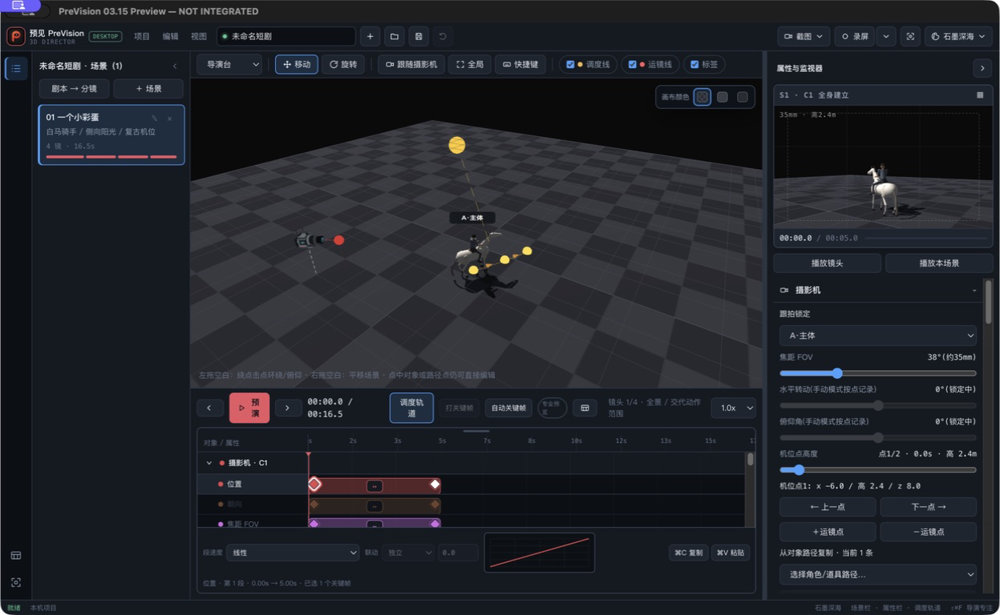

# 03.15 摄影机位置点删除与跟随：隔离快速预览

## 第一版证据

- 实现提交：`8f1eda7eb1f5e71cbbb23074233cf2e5a1474a73`
- 运行方式：工作树 Electron + 独立 `userData`
- 窗口标题：`PreVision 03.15 Preview — NOT INTEGRATED`
- 窗口请求尺寸：1440×900
- Electron 实际窗口尺寸：1440×888（当前显示器可用工作区限制）
- CoreGraphics：标题匹配、`onscreen=1`、layer 0
- Computer Use 真实 UI：窗口内容 URL 指向本工作树生成入口；截图为当前可见窗口，1247×768 像素

## 聚焦检查

- Follow Camera 在真实 AX 树中是“跟随摄影机”切换按钮，默认 `Value: 0`，帮助文本明确“不写入项目”。
- 当前镜头 Position 两个点均为带逐点名称和时间的切换按钮，初始 `Value: 0`。
- 点击第一个 Position 点后，其 AX 状态变为 `Value: 1`，时间轴状态显示“已选 1 个关键帧”；截图中红色选中态和内嵌焦点环可见。
- 主视口、监视器、时间轴和摄影机检查器同时可见，布局未出现遮挡。

## 边界

- 这是隔离快速预览，不是中央集成、固定 App 或发布版本。
- 未运行 `app:deliver`，未替换或启动 `~/Applications/PreVision.app`。
- 三尺寸矩阵、最终 R2 和稳定预览留待用户确认后执行。
