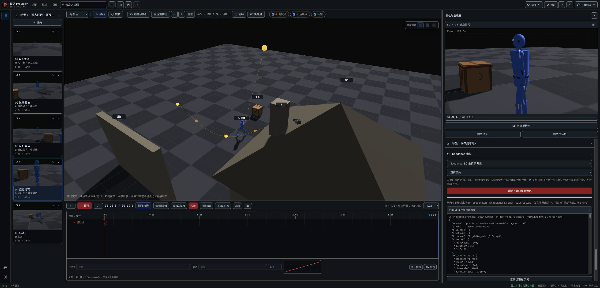

# Seedance 白模 Chrome MP4 严格校验证据

日期：2026-08-02
任务：`01.16-web-seedance-white-mp4-validation`
状态：任务分支真实 Chrome/LAN 验证通过，尚未中央集成或固定 App 交付

## 结论

macOS Google Chrome 150.0.7871.187 通过真实 LAN 打开任务分支预览，当前镜头为 5.0 秒。持久诊断先复现 RED：计划为 150 帧 / 5 秒 / 30fps，编码容器实际为 150 帧 / 5.373 秒 / 27.917365fps；frame ledger 仍为 planned/rendered/requested=150/150/150，证明失败不是账本帧数丢失，而是同步渲染耗时进入 MediaRecorder 时间轴。严格校验拒绝了 ZIP 和下载，失败后诊断仍可展开、复制并重试。

第一版修复曾被独立 R2 判为 BLOCK：它把两个 `moof` 的 sample duration 都改成目标帧时长，却没有同步第二段 `tfdt`。UI/manifest 因而误报 150 帧 / 5 秒 / 30fps，实际分片边界仍有 3185/30000 秒空洞，ffprobe 时长为 5.106167 秒。该结果不计为 GREEN。返工后 inspector 会持久记录 `timelineGapTicks` / `timelineOverlapTicks`，严格校验要求二者均为零；normalizer 同步重写 `tfdt` 与对应 `mfra/tfra`，对 `sidx` 或 edit list 保守拒绝。

修复后，同一浏览器与 LAN 路径得到以下结果：

- recorder 原始媒体：150 帧，durationTicks=152374 / timescale=30000，5.079133 秒，29.532597fps，并真实记录到 `timelineGapTicks=147`。
- 最终严格媒体：150 帧，durationTicks=150000 / timescale=30000，5 秒，30fps。
- capture ledger：planned/rendered/requested=150/150/150，另有 1 个不计入计划的启动 primer；`startSource=listener-after-primer`。
- 启动与排空：primer 后收到真实 `start`，首末计划帧请求为 294.7ms / 5274.2ms；随后 `drain → requestData → dataavailable → stop → dataavailable → onstop` 完整完成，共 16 个有序事件。
- 第二次真实用户点击触发浏览器下载。Chrome 自动化会话将两个下载保留为 `.crdownload` 临时名；两个 ZIP 均为 54,311 字节且 SHA-256 均为 `ca0b4a3b…dc2f0`。两份 manifest 均严格通过，内含 MP4 均为 H.264、150 帧 / 5 秒 / 30fps。ffprobe 8.1.2 对两份 MP4 都得到 format/stream duration=5.000000、150 packets、30/1；第 101→102 包 DTS 连续，全包 discontinuities 为空。未手工改名、移动或删除用户下载文件。

截图文件的实际像素为 2560×1232，显示 C04 高亮、`S1C4` 生成完成、再次下载入口及持久诊断：

## 根因与修复边界

根因包含三个相互关联的浏览器时序问题：原实现到目标采样时刻才同步渲染再 `requestFrame()`，渲染成本因此拉长容器时间轴；真实 Chrome 还需要一个不计入计划的 primer 才发出可依赖的 MediaRecorder `start` 事件，若把首个计划帧当 primer 会得到 149 个编码样本；Chrome 的多 `moof` MP4 还可能在 `tfdt` 分片解码起点留下 gap 或 overlap，不能只累加/重写 sample duration。

修复将计划帧提前渲染，在绝对采样时刻只请求已渲染帧；primer 后等待真实 `start` 才开始 150 个计划请求；尾帧排空同时锚定“首请求 + 计划时长”和“末请求 + 一帧”。Chrome 仍可能按墙钟为容器写入波动的 sample delta 与分片 decode start，因此仅在已确认 H.264 且编码样本数精确等于计划时，同步归一化 ISO-BMFF sample timing、`tfdt` 与可安全映射的 `tfra`。最终 inspector 再从字节重读并要求 frameCount、duration、fps 严格匹配且 gap/overlap 均为零；任何 149/151 帧、非 H.264、缺失/异常 box、`sidx`、edit list 或残余时间线断裂都继续在 ZIP 生成与下载前拒绝。

## 当前镜头身份回归

用户随后提供了解压后的真实反例：界面已选 C04，但 `02_timestamps.json`、`04_manifest.json` 与媒体文件仍全部指向 `S1C1 / shotIndex=0`。根因不是 planner 取错当前镜头，而是首次生成后保留的已验证 C01 ZIP 没有绑定/复核当前选择；切 C04 后，按钮仍走“重新下载旧 pending 包”。

首轮返工把 pending ZIP 绑定到 project、scene、scope、aspect，以及 `shot` scope 下的当前 shot index/ref。下载前再次核对身份；若选择已变，第一次点击会清除旧 pending 包并为新当前镜头开始生成，只有新包 ready 后的下一次真实点击才下载。C7 先生成/下载 C01，再切 C02 点击旧按钮，证明新事务计划为 `S1C2` 且 cancel 后 project/stage/history/autosave 零写。

第二轮独立 R2 随后用同一个 scene/shot 对象原地把 yaw 从 0 改为 17，证明只比较对象 ref 和 index 仍会把旧 ZIP 当成当前内容；pending 还会强引用旧 project/scene/shot 对象。最终返工把身份改为只含 scope、scene/shot index、aspect 和 SHA-256 作者内容指纹：指纹覆盖工程名、场景名与冻结 `stageToData()`；下载时从当前状态重新计算，只有完全相同才允许复用。pending 不再保存 project/scene/shot 对象引用，仍只保留一个已验证 Blob 以满足显式二次下载/失败重试合同。C7 新增同一个 shot 原地编辑、scene scope 同对象内容编辑、cancel/retry 和零 project/stage/history/autosave 写断言。

同一 Chrome/LAN 真机随后按用户原步骤复测：

- C01 生成并真实下载后，下载计数为 1，包内为 `S1C1 / shotIndex=0`。
- 切到 C04 后第一次点击旧“重新下载”按钮，下载计数仍为 1；界面进入新的 `S1C4` 生成，而不是重复下载 C01。
- C04 ready 后第二次点击，下载计数才变为 2。新 ZIP SHA-256 为 `d935e598…e3fce`；manifest/timestamps/MP4 全部为 `S1C4 / sceneIndex=0 / shotIndex=3`。
- C04 MP4 为 H.264、105 帧 / 3.5 秒 / 30fps；项目 inspector/assert 与 ffprobe 均通过，105 packets、无时间戳断层。首末帧 MD5 不同只能证明画面内容有运动；C04 的作者设定是固定机位，不能写成摄影机运动。
- 页面业务投影前后 SHA-256 相同，undo 始终 disabled，autosave 状态文案不变；此项是页面级只读证据，未读取浏览器存储。自动零写结论另由 C7 的 project/stage/history/autosave 字节级断言覆盖。

最终内容指纹构建（4175 `/director/` 为 1,393,279 字节，SHA-256 `cded24b0…90dac`）又在 Chrome 150.0.7871.187 完整复测一次：下载计数从 302→303 取得 C01；切 C04 后第一次旧按钮点击仍为 303，只进入第4镜新生成；ready 后第二次才变 304。C01 为 150/5/30；C04 ZIP 为 1,499,240 字节、SHA-256 `fdfbd87f…9d89`，内含 `S1C4 / shotIndex=3`、H.264/avc1 1920×1080、105 帧 / 3.5 秒 / 30fps，manifest/timestamps/current inspect/assert 与 ffprobe 全通过且 105 packets 无断层。附加同镜头复测把 C04 时长从 3.5 改为 3.6 后点击旧按钮，下载计数保持 304 并开始新的 108 帧 / 3.6 秒生成；随后用 Undo 恢复 3.5，未下载第三包。C04 下载仍显示 Chrome `.crdownload` 临时名，但字节完整且可作为 ZIP 严格解析。

## 零写与限制

- 自动故障注入覆盖 start 确认、primer、预渲染节拍、尾帧 drain/dataavailable/onstop、fragmented/non-fragmented timing、真实多 `moof` gap/overlap、`tfdt/tfra`、`sidx/elst` 保守拒绝、149/150 严格拒绝、finalize/cancel/error/retry 和 project/history/autosave/material 恢复。
- 真机操作未调用付费 Seedance，也未上传素材。
- 使用当前自动恢复项目中的 5 秒当前镜头验证；现场项目含其他场景/镜头，因此不能把本次截图声称为“整个项目只有一个场景/一个镜头”。白模 scope 明确为当前镜头，包内只包含该 5 秒 clip。
- 任务预览使用同一 LAN 主机的临时 4175 端口；固定 4174 稳定预览指针、固定 App、GitHub 与 Pages 均未更新。
- 结构化原始数值见 [evidence.json](evidence.json)。
