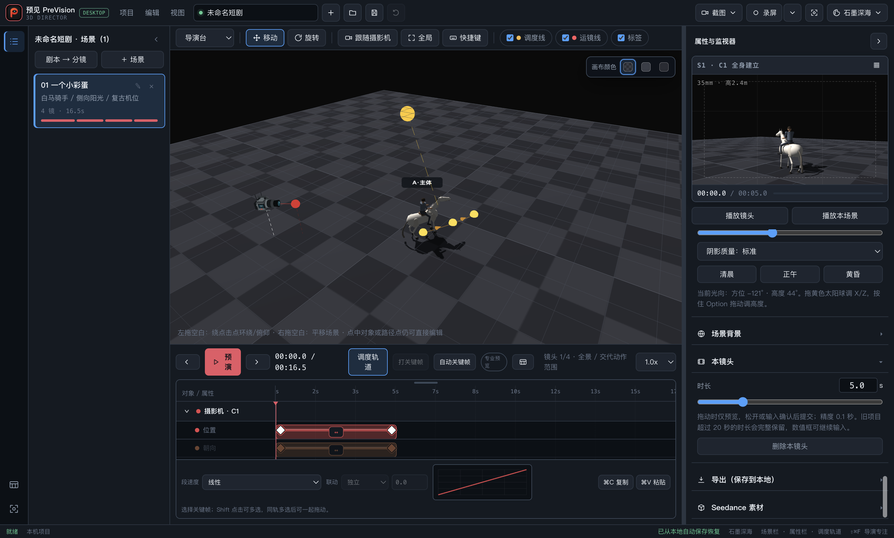

# 02.7 镜头时长、关键帧边界与区间条 QA

## 当前结论

三路全新、实现者之外的独立只读 R3 均为 PASS，结论为 P0=0、P1=0、P2=0。

- `pointSync` 安全路径只有在物化时刻与既有 actor scene-global `pathTimes` 逐项相等时成立；相等时不重写 actor times，不相等时在任何 project/history/autosave 写入前原子拒绝。
- camera、actor、prop 的 segment 始终由当前相邻 times/ease 实时派生，不新增持久字段；segment `aria-hidden`、无 `tabindex`、`pointer-events:none`，不会取得焦点或遮挡 key 命中。
- 时长输入草稿在 `refreshShotPanel()` / `refreshShotDurationControls()` 刷新后仍保持 `5.1`；Enter 引发的提交与后续 blur 最多形成一次事务，Escape、非法输入和所有拒绝路径保持 project、runtime、preview sidecar、history、dirty/autosave、localStorage、`project.modified` 零写。

TIME-005 仍保持 `IMPLEMENTED_UNVERIFIED`：实现和独立 R3 已通过，但中央集成、最终回归、固定 App 交付以及用户在稳定预览中的最终实测尚未完成。

## 环境与定向门禁

- 日期：2026-07-27
- 分支：`feat/02.7-shot-duration-boundaries-segments`
- 精确基线：`777c902febbd18ab3d0582e26ebf9d2e977f66d8`
- 当前受审代码 HEAD：`6b84bc557eb44d4aeb4ae0d783928c55b2d9a74a`
- Node：v24.18.0
- Electron：43.1.0
- 固定 App、稳定预览指针、GitHub 与 Pages：本任务未修改

独立 Node 24 短门禁的真实结果：

- camera：106 通过、0 失败
- timeline：169 通过、0 失败；父进程与 legacy isolate 子进程均为 Node v24.18.0
- i18n：217 通过、0 失败
- build 与 `git diff --check`：通过

本轮 R3 证据收口没有重跑任何测试，也没有运行 `test:full`、`test:impact` 或 layout。

## 现有 PNG 的来源与证明边界

- 引入提交：`391687599f86568da0ef8e8c6be908e979828ecb`
- Git blob：`091c137d9cc4cfcdb83a16d76968076dc0dc5d10`
- 文件 SHA-256：`691d38a2e57ecf7b2a3ff09f40e1d39471d6f1268c27ddc6c5553a2377415f5e`
- 原始 PNG：2880×1736，Retina 2× content capture，对应约 1440×868 内容区；它不是 CSS 1440×900 内容截图
- `2c9664c2b47d7c0bd56e8b022d7f6fed3ce1e852` 与 `6b84bc557eb44d4aeb4ae0d783928c55b2d9a74a` 均未改变该文件

该 PNG 只支持首版任务级时长控件和 segment UI 已经可见，不能证明 `6b84bc5` 中“周期刷新后仍显示 5.1 草稿”的新行为，也不能证明最新 owner BrowserWindow 的前台焦点、输入命中或窗口来源绑定。此前唯一一次新 owner-harness 没有留下完整 stdout/result 或新 PNG，因此没有被计为人工 PASS，也没有据此生成证据提交。

`6b84bc5` 的新草稿行为由代码审查、定向自动回归和三路独立 R3 支持；缺少新 owner 截图按 00 的快速预览裁决记录为非阻断 P3，待 Leo 在稳定预览中实测。本文不把它表述为已完成新 UI 人工验证。

## 未完成边界

- project schema 保持 v5；没有新增持久字段，AutoKey 参数 sidecar 没有扩展到 project 存档。
- 首版对无法同时保持绝对秒的联动、截断或物化采取 fail-closed 原子拒绝。
- 中央集成、最终回归、固定 App 安装/启动确认和公开发布均未完成。
- 本文是任务分支的 R3 证据边界，不代表已集成、已交付固定 App 或已发布。
