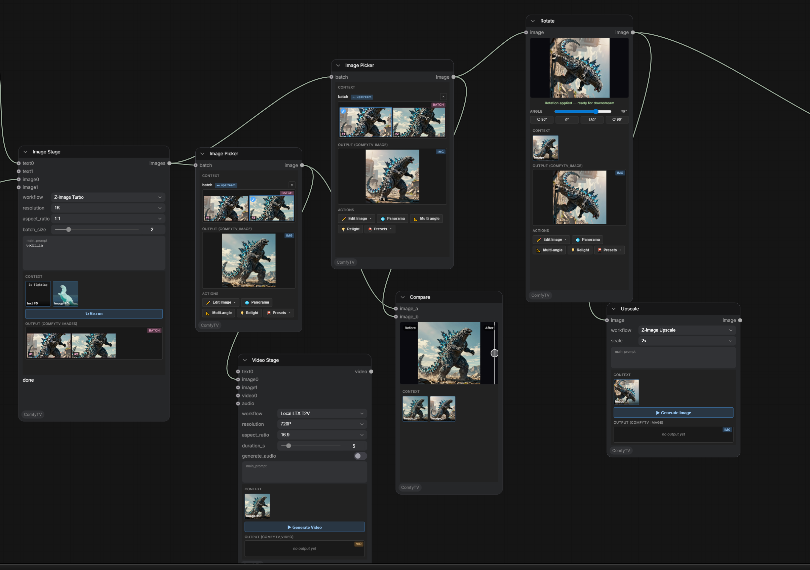

<!-- Language: **English** | [简体中文](README.zh.md) -->

**English** | [简体中文](README.zh.md)

# ComfyTV
ComfyTV — the canvas-based app that truly belongs to ComfyUI.

ComfyTV turns ComfyUI into a **TapNow / LibTV-style canvas app** — and keeps going, all the way to a full media workbench. Every operation is its own node; results flow downstream automatically. Chain stages into a complete flow: **generate → pick → edit → composite → export**, across image, video, audio, music, panorama, 2D layers, and 3D.

Today that means **~190 stages**, each with its own reference page.

📖 **Documentation: [comfytv.org](https://comfytv.org)** — bilingual (English / 中文) guides plus a per-node reference for every stage.



---

## Core ideas

- **Per-node Run**: each stage runs on its own, not through ComfyUI's global queue. Downstream stages consume the **snapshot** of an upstream stage's last output, so re-running one node doesn't drag the whole chain with it.
- **Project-centric**: stages belong to a project; every output is kept with full history and restores on reload.
- **Your models, your workflows**: a curated set of workflows ships under `workflows/<kind>/`, all running against your own local models. Import any ComfyUI workflow as JSON, bind its inputs in the sidebar GUI editor, save per-stage presets, and star a default workflow per stage.
- **Part of the ComfyUI ecosystem**: subgraphs and third-party plugins just work; **Bridge nodes** connect any plugin into a ComfyTV pipeline; remote ComfyUI machines can be registered as extra runners (Servers tab) with capability preflight.
- **Libraries built in**: a project **asset library** (images / video / audio / 3D models), a **resource library** (LUTs, fonts, SoundFonts), and reusable **prompt fragments** — all in the [7-tab sidebar](docs/sidebar.md), and all reachable from any prompt via `@` references.
- **Rich in-node editors**: many stages embed a real editor in the node — layer editor, storyboard workbench, piano rolls, 3D viewports, scopes — with live previews on most video effects.

## What's inside

### Image
Generation (text-to-image, image-to-image, edit, inpaint, outpaint, erase, upscale, relight, variations, multi-angle 3D camera), instant browser-side tools (crop / rotate / mirror / grid split), SAM-based part splitting + mask cleanup, line-art extraction, contact sheets.

### 2D layer editor & storyboard
A full layered editor inside a node: raster, text (real font parsing), vector-shape, parametric-fill (solid / gradient), and adjustment layers; per-layer masks; selections with magic wand, boolean ops and morphology; non-destructive transforms; undo; **PSD import & export**. The storyboard workbench reuses the same engine per board and adds onion skin, timeline playback, animatic / GIF / PDF / ZIP export, and Fountain script import.

The editor engine is developed as its own project, **[Pentrado](https://github.com/jtydhr88/pentrado)** — try it standalone in your browser at **[pentrado.com](https://pentrado.com)**.

### Video (~100 nodes)
- **Edit**: clip, split, concat, crop, resize, speed / reverse, rotate, scene detect, frame extraction, proxy generation with transparent proxy playback.
- **Color**: color wheels / curves / LUT / ASC CDL / HueCorrect / selective color / histogram EQ / gray world.
- **Keying**: chroma key plus a full keyer suite — PIK, Keyer, Despill, Color Suppress, KeyMix, matte monitor / morphology, Select0r.
- **Roto & tracking**: bezier roto masks with feather, point motion tracking, optical-flow mask propagation, corner pin, paint strokes with clone brushes.
- **Compositing**: 39 blend modes, keyframed transforms, 57 xfade transitions + luma wipes, time remap, sequencing.
- **FX**: glow, god rays, particle system, lens distortion (multiple lens models), chromatic aberration, lens flare, Z-defocus, old film, regrain, glitch, kaleidoscope, wave warp, water, light graffiti, slit scan, feedback, strobe, stylize, and more.
- **360**: projection + stabilization for 360° footage, Card3D, STMap UV remapping + STMap generator.
- **Infrastructure**: parameter expressions, **FX Chain** (stack many effects, render in a single pass), scopes (waveform / vectorscope / histogram), titles / subtitles / annotations, speech-to-text subtitle generation.

### Audio (30+ nodes)
Dynamics (compressor / gate / limiter / de-esser), parametric EQ with graph UI, loudness normalization, denoise / repair, echo, modulation, stereo tools, time-stretch / pitch-shift, saturation; **convolution reverb** — including capturing the sound of your own room — and an algorithmic reverb; **stem split** into vocals / accompaniment / drums / bass / other (built in, nothing extra to install), noise reduction, beats & notes extraction; mix, crossfade, sidechain ducking, segment export, analysis and visualization; audio-reactive parameter automation and meter overlays for video.

### Music (symbolic)
Score stage with MusicXML and engraved notation, piano-roll **score and MIDI editors**, performance rendering with style profiles, a SoundFont (SF2/SF3) synthesizer, click track, and chord accompaniment — composition → performance → synthesis → mixing on one canvas.

### Panorama
360° viewer with single- and multi-viewport capture; text-to-panorama and image-to-panorama workflows.

### 3D
Scene3D DCC-style stage (multi-camera, keyframed camera paths, multi-channel viewport capture), 3D model generation and loaders, a geometry workshop (mesh ops, booleans, primitives, map baking), PBR material stage with per-part material binding, and line-art rendering from 3D.

### Compose & flow
Auto-spawned pickers (image / audio / video), A/B compare, track-style sequence assembly; a full director timeline and a storyboard → per-shot image pipeline are on the [roadmap](docs/roadmap.md).

---

## Install

```bash
cd ComfyUI/custom_nodes
git clone https://github.com/jtydhr88/ComfyTV
```

Restart ComfyUI. ComfyTV nodes appear under the **`ComfyTV`** category in the Add-Node menu, grouped into sub-categories (Project / Input / Generate / Image / Panorama / Video / VideoFX / Keying / Compose / Timeline / Audio / AudioFX / Music / 3D / Material / Storyboard / Bridge).

### ComfyUI Desktop / macOS / multiple ComfyUI installs

If you use ComfyUI Desktop, are on macOS, or have more than one ComfyUI on your machine, the relative `cd ComfyUI/custom_nodes` above can easily drop you into the wrong instance (a common symptom: the clone succeeds but ComfyTV never shows up). Install into the *running* instance by its absolute path instead:

1. **Find the running instance.** Read the ComfyUI startup log — it prints the base path it loaded from, e.g. `/Users/you/Downloads/ComfyUI (1)/ComfyUI`. That is the instance to install into.
2. **Clone straight into that instance's `custom_nodes`, quoting the path** (quotes are required if it contains spaces or parentheses). Keep it on **one line** so no stray line-continuation `\` splits it apart:
   ```bash
   git clone https://github.com/jtydhr88/ComfyTV.git "/Users/you/Downloads/ComfyUI (1)/ComfyUI/custom_nodes/ComfyTV"
   ```
   If you must wrap it across lines, the `\` has to be the very last character of the line with nothing after it — a stray `\` at the end of the `cd` line, for example, silently joins the next command so `git clone` never runs on its own.
3. **Verify the layout.** The first level of `custom_nodes/ComfyTV/` must contain `__init__.py`. If you instead see a nested `ComfyTV/ComfyTV/…`, move the inner folder up one level.
4. **Fully restart the ComfyUI backend** (quit and relaunch the Desktop app, or stop and restart the server — not just a browser refresh). On success the startup log shows ComfyTV loading and registering its nodes.

---

## User guides

The full documentation lives at **[comfytv.org](https://comfytv.org)** — guides plus a reference page for every node, in English and 中文. The guide sources are also browsable in [`docs/`](docs/):

| Guide | What it covers |
|-------|----------------|
| [getting-started.md](docs/getting-started.md) | Install, the canvas basics, your first generation, per-node Run, picking from a set |
| [sidebar.md](docs/sidebar.md) | The 7-tab sidebar: workflow config, asset library, prompt fragments, stage manager, presets, resources, servers — plus `@` references in prompts |
| [generate.md](docs/generate.md) | Text / Image / Video / Audio generation, choosing a model, running |
| [image-tools.md](docs/image-tools.md) | Crop, Rotate, Mirror, Inpaint, Erase, Cutout, Upscale, Outpaint, Grid Split, Variations, Multiangle, Relight |
| [panorama.md](docs/panorama.md) | Loading/viewing a 360° panorama, capturing single + multi viewports |
| [video-and-audio.md](docs/video-and-audio.md) | The video & audio suites: editing, color, keying, compositing, FX, audio processing |
| [making-music.md](docs/making-music.md) | Composition → performance → synthesis → mixing on one canvas: MusicXML, every Music-node parameter, reverb presets |
| [compose.md](docs/compose.md) | Pickers, A/B Compare, and the bigger arranging tools |
| [roadmap.md](docs/roadmap.md) | What works today vs **TODO** (backend workflows not yet built) |
| [models.md](docs/models.md) | Per-workflow model files + folder locations + download URLs for everything shipped under `workflows/` |
| [custom-workflows.md](docs/custom-workflows.md) | Adding your own ComfyUI workflow as a JSON file (no Python edits) |
| [sidebar-config-editor.md](docs/sidebar-config-editor.md) | The sidebar GUI for editing how a stage's inputs map to its workflow nodes |
| [bridges.md](docs/bridges.md) | Connecting third-party ComfyUI plugins (mesh2motion, IPAdapter, …) via Bridge nodes |

---

## MCP server (agent access)

ComfyTV ships a built-in, **read-only** [MCP](https://modelcontextprotocol.io) endpoint so AI agents (Claude Code, Claude Desktop, any MCP client) can inspect your ComfyTV state — projects, the live canvas, workflows, outputs, assets, remote jobs, and recent execution errors. Nothing here can run or modify anything.

It runs inside the ComfyUI server process — no extra install:

```
claude mcp add --transport http comfytv http://127.0.0.1:8188/comfytv/mcp
```

Notes:

- **Canvas visibility needs an open ComfyTV page.** The `get_canvas` tool reads a snapshot the ComfyTV frontend mirrors to the backend every few seconds; that page can be inside Comfy Desktop or a browser. With no page open the tool reports `available: false` rather than guessing.
- **Zero cost when unused.** The canvas mirror stays dormant until an MCP client actually connects — users who never attach an agent get no background ticks or requests. Right after connecting, give the mirror ~10 seconds to warm up before the first `get_canvas`.
- **Trust boundary.** The endpoint has the same (lack of) auth as every other ComfyUI route — if you expose port 8188 beyond localhost, the MCP endpoint is exposed with it.
- **Pairs with [comfy-mcp](https://github.com/Comfy-Org/comfy-mcp).** comfytv-mcp covers the product layer (projects/canvas/stages); the official comfy-mcp covers the machine layer (installing nodes, downloading models, running raw workflows). Agents work best with both connected.
- Local stage failures are also captured in a small in-memory buffer (`exec_errors` tool / `GET /comfytv/exec_errors`) so an agent can diagnose a failed run without tailing logs.

---

## Quick tour

1. Drop a **Generate → Image** node, type a prompt, pick `Local SD1.5` as the workflow, click **Run**. It produces a set of images and auto-spawns an **Image Picker**.
2. Pick a frame in the picker. Its `✏️ Edit` toolbar offers Inpaint / Crop / Rotate / Mirror / Grid Split / Upscale / Outpaint / Cutout.
3. Crop / Rotate / Mirror happen entirely in the browser — no Run needed.
4. Wire the picked image into a **Generate → Video** node (`Local LTX I2V`) and Run.
5. Chain a few **VideoFX** nodes (color, glow, grain, …) into an **FX Chain** and render them in a single pass — most effects preview live right in the node.
6. Use **Compose → Compare** to A/B the before/after.

---

## License

See [LICENSE](LICENSE).
