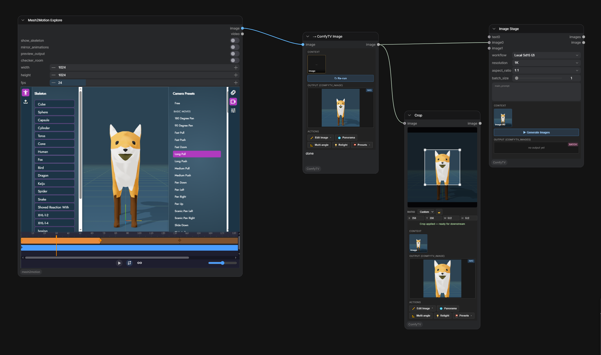

**English** | [简体中文](bridges.zh.md)

# Bridge nodes — connecting other ComfyUI plugins

Any ComfyUI plugin that outputs `IMAGE` / `VIDEO` / `AUDIO` (mesh2motion, IPAdapter, ControlNet preprocessors, 3D nodes, any future plugin) can plug into a ComfyTV pipeline through the **bridge** nodes.

```
[any plugin]   IMAGE          [ComfyTV → Image]   COMFYTV_IMAGE        [Image Picker / Upscale / …]
  output    ──────────────→     bridge stage    ──────────────────→     ComfyTV stages
                              (Run + snapshot)
```

The bridge is itself a **ComfyTV stage** with its own Run button. Click Run, the upstream runs once, the URL is stored as the snapshot; downstream ComfyTV stages then use that snapshot on subsequent Runs instead of re-running.

## Into-bridges

`ComfyTV/Bridge` contains 5 into-bridge nodes that take a native or third-party plugin's output and pull it into ComfyTV:

| Node | Input | Output |
|---|---|---|
| `→ ComfyTV Text`   | STRING      | COMFYTV_TEXT    |
| `→ ComfyTV Image`  | IMAGE       | COMFYTV_IMAGE   |
| `→ ComfyTV Images` | IMAGE batch | COMFYTV_IMAGES  |
| `→ ComfyTV Video`  | VIDEO       | COMFYTV_VIDEO   |
| `→ ComfyTV Audio`  | AUDIO       | COMFYTV_AUDIO   |

Into-bridges have a Run; their output persists with the project.

## Out-bridges

The reverse direction also exists: 5 out-bridge nodes turn a ComfyTV snapshot back into native ComfyUI types, so any plugin can consume what a ComfyTV pipeline produced:

| Node | Input | Output |
|---|---|---|
| `← ComfyTV Text`  | COMFYTV_TEXT  | STRING |
| `← ComfyTV Image` | COMFYTV_IMAGE | IMAGE  |
| `← ComfyTV Mask`  | COMFYTV_IMAGE | MASK   |
| `← ComfyTV Video` | COMFYTV_VIDEO | VIDEO  |
| `← ComfyTV Audio` | COMFYTV_AUDIO | AUDIO  |

`← ComfyTV Mask` reads the image's alpha channel as a mask — handy for feeding a Cutout or painter result into native inpainting nodes.

## Common patterns

### Plugin output → ComfyTV downstream
```
[mesh2motion] ─VIDEO─→ [→ ComfyTV Video] ─COMFYTV_VIDEO─→ [Video Color / Stabilize / …] → …
```

### Round trip: ComfyTV result → native plugin → back
```
[Image Stage] → [← ComfyTV Image] ─IMAGE─→ [any native plugin] ─IMAGE─→ [→ ComfyTV Image] → …
```

### Plugin output is a multi-frame IMAGE batch
For plugins that output an IMAGE batch but no VIDEO object, chain ComfyUI's `Create Video` first:
```
[plugin] ─IMAGE batch─→ [Create Video (fps)] ─VIDEO─→ [→ ComfyTV Video] → …
```

### Third-party LLM / prompt enhancer → ComfyTV prompt
Any ComfyUI node that outputs STRING (a prompt enhancer, a captioner, a custom LLM) can feed text into a ComfyTV pipeline:
```
[Prompt Enhance (Comfy-Org)] ─STRING─→ [→ ComfyTV Text] ─COMFYTV_TEXT─→ [Image / Video Stage] → …
```

## File locations

Into-bridges write to ComfyUI's output directory under `output/ComfyTV/bridge/…`:

| Bridge | Format | Subfolder |
|---|---|---|
| Image / Images | PNG (one per frame) | `output/ComfyTV/bridge/` |
| Video          | MP4 (auto codec)    | `output/ComfyTV/bridge/` |
| Audio          | WAV (universal, no codec deps) | `output/ComfyTV/bridge/` |
