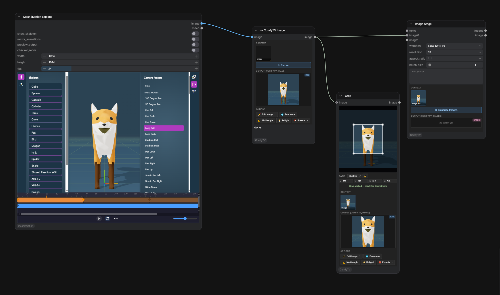

[English](bridges.md) | **简体中文** 
# Bridge 节点 , 接入其它 ComfyUI 插件

任何输出 `IMAGE` / `VIDEO` / `AUDIO` 的 ComfyUI 插件(mesh2motion、IPAdapter、ControlNet preprocessor、3D 节点、未来的任何插件等)都可以通过 **bridge** 节点接入 ComfyTV 流水线。

```
[任何插件]   IMAGE          [ComfyTV → Image]   COMFYTV_IMAGE        [Image Picker / Upscale / …]
  输出     ────tensor─────→     桥 stage        ─────/view URL─────→     ComfyTV stage
                              (运行 + snapshot)
```

桥本身就是一个 **ComfyTV stage**,有自己的运行按钮。点运行跑一次上游、把 URL 存为快照;下游 ComfyTV stage 再运行时直接用这个快照,不会重新跑上游。

## 入桥

`ComfyTV/Bridge` 分类里有 5 个入桥节点,把原生或是第三方插件的输出接进 ComfyTV:

| 节点 | 输入 | 输出 |
|---|---|---|
| `→ ComfyTV Text`   | STRING     | COMFYTV_TEXT    |
| `→ ComfyTV Image`  | IMAGE      | COMFYTV_IMAGE   |
| `→ ComfyTV Images` | IMAGE 批量 | COMFYTV_IMAGES  |
| `→ ComfyTV Video`  | VIDEO      | COMFYTV_VIDEO   |
| `→ ComfyTV Audio`  | AUDIO      | COMFYTV_AUDIO   |

入桥自带运行按钮,输出会跟项目一起持久化。

## 常见用法

### 插件输出 → ComfyTV 下游
```
[mesh2motion] ─VIDEO─→ [→ ComfyTV Video] ─COMFYTV_VIDEO─→ [Video Upscale] → …
```

### 插件输出是多帧 IMAGE batch
有些插件输出的是 IMAGE 批量而不是 VIDEO 对象,前面串一个 ComfyUI 自带的 `Create Video`:
```
[插件] ─IMAGE 批量─→ [Create Video (fps)] ─VIDEO─→ [→ ComfyTV Video] → …
```

### 第三方 LLM / 提示词增强插件 → ComfyTV 的提示词
任何输出 STRING 的 ComfyUI 节点(提示词 enhancer、caption、自定义 LLM)都能把文本送进 ComfyTV 流水线:
```
[prompt Enhance (Comfy-Org)] ─STRING─→ [→ ComfyTV Text] ─COMFYTV_TEXT─→ [Image / Video Stage] → …
```

## 文件位置

入桥写到 ComfyUI 的 output 目录下 `output/ComfyTV/bridge/…`:

| 桥 | 格式 | 子文件夹 |
|---|---|---|
| Image / Images | PNG(每帧一张) | `output/ComfyTV/bridge/` |
| Video          | MP4(自动选 codec) | `output/ComfyTV/bridge/` |
| Audio          | WAV(通用,不依赖编码器) | `output/ComfyTV/bridge/` |
