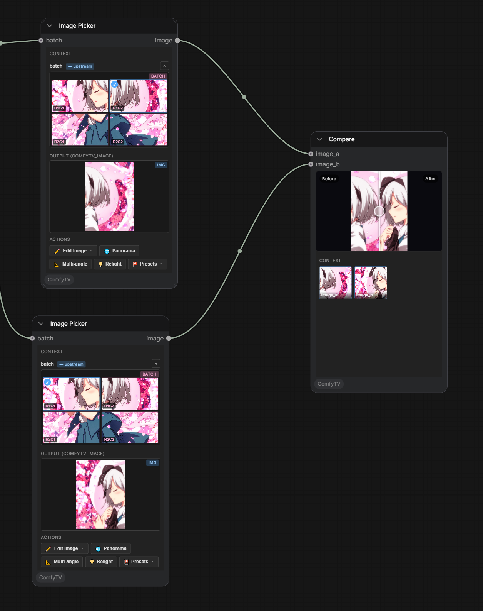

[English](compose.md) | **简体中文**

# 拼接 & 编排

## Image Picker(图片选择器)

从一组图(来自 Image Stage、Grid Split、Image Variations、Panorama Multi-View……)里选**一张**。

- 点缩略图选中单图输出。
- Picker 带完整的**操作工具栏**(`✏️ Edit`、`🌐 Panorama`、`📐 Multiangle`、`💡 Relight`、各种预设)。
- Image Stage **第一次运行时会自动创建** picker。

---

## Compare(A/B 对比)

一个前后**滑条**对比器，比较 **image_a**(原图)和 **image_b**(改后)。

