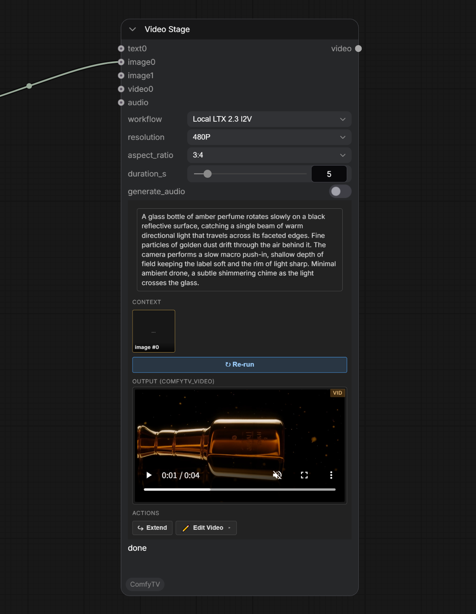
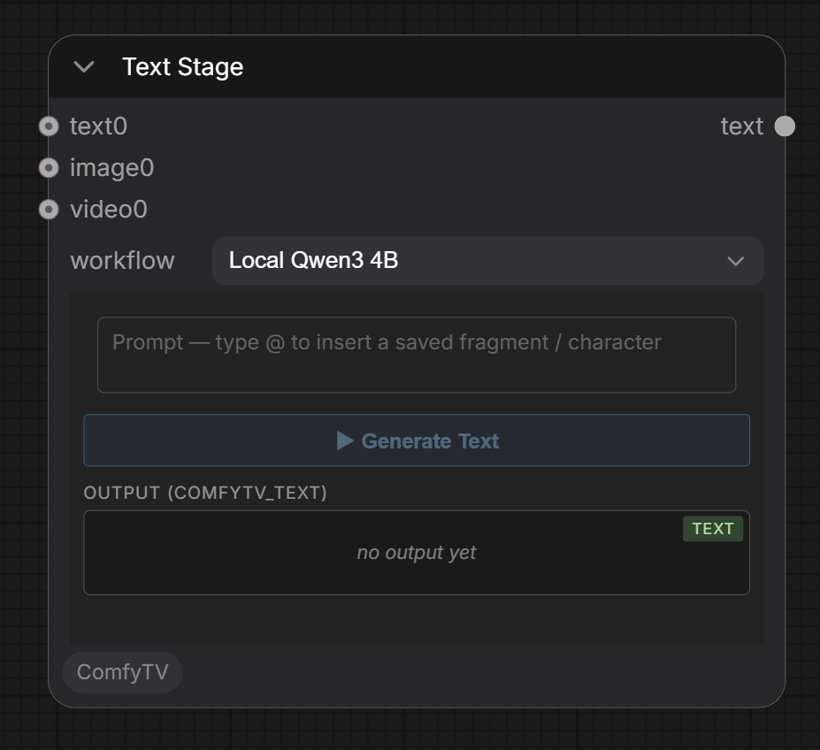
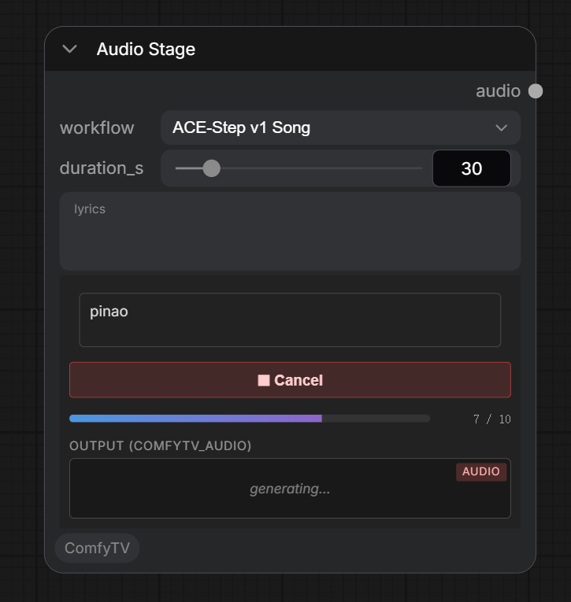

**English** | [简体中文](generate.zh.md)

# Generating content

The **ComfyTV / Generate** group has the stages that create new content from a prompt: Text, Image, Video, Audio.

Every generator works the same way: type a prompt, pick a **workflow** (model) from the dropdown, click **▶ Run**. The result shows in the node's preview and flows to anything wired downstream.

---

## Image Stage

- **Prompt**: the main text box. Upstream **Text** nodes get appended; upstream **images** feed the current workflow's `LoadImage` (only the i2i workflow consumes them).
- **workflow** — the dropdown lists every workflow under `workflows/image/`. Today: **Local SD1.5** (t2i), **Local SD1.5 I2I** (image-to-image), **Image Ideogram4 T2I**.
- **resolution / aspect_ratio / batch_size**: target size tier, shape, and how many images per Run.

**Two outputs**: `images` is the whole batch from this Run; `image` is the single thumbnail you picked on the node (defaults to the first one until you click).

### Image-to-image
Pick `Local SD1.5 I2I`, wire a reference image into the **images** slot, write the prompt, Run.

---

## Video Stage

- **workflow** — all four LTX 2.3 variants ship today:
  - `Local LTX 2.3 T2V` — text → video.
  - `Local LTX 2.3 I2V` — image → video.
  - `Local LTX 2.3 FLF2V` — first-last-frame → video. Wire **two** images on **images** (start + end keyframes).
  - `Local LTX 2.3 IA2V` — image + audio → video.
- **resolution / aspect_ratio / duration**: output size, shape, length.
- **audio** input — required for IA2V; the other LTX workflows don't use audio.

---

## Text Stage

Local LLM text generation (built-in **Qwen3 4B**). Use it to expand a prompt, write a description, or feed other stages' context slots.

---

## Audio Stage

Text-to-music via **ACE-Step v1 3.5B**;

- **Prompt**: free-form tags — genre, mood, BPM, instrumentation.
- **Lyrics** (optional): empty = instrumental; non-empty = vocal track.
- **Duration**: slider (1–240 s, default 30).

Output is a single FLAC audio file.

---
