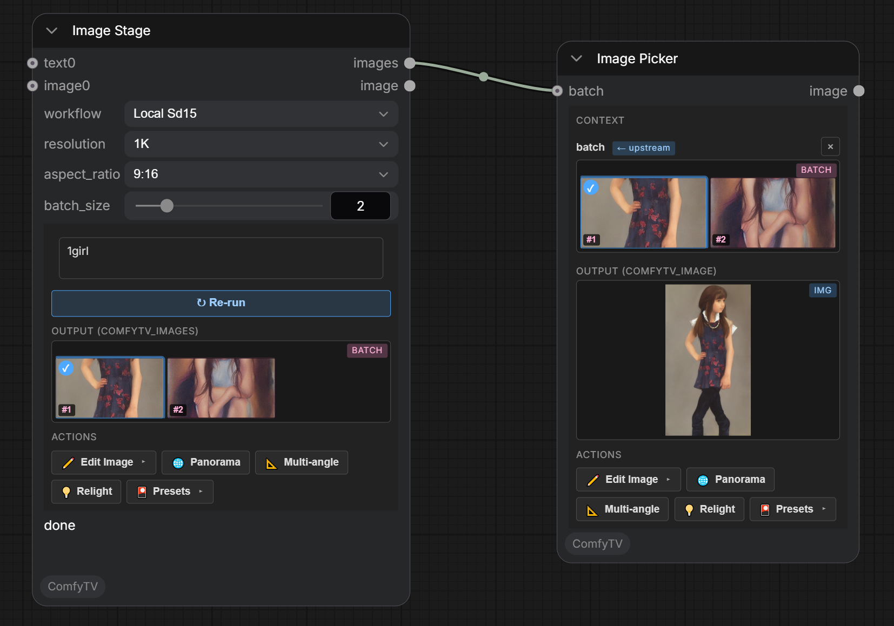
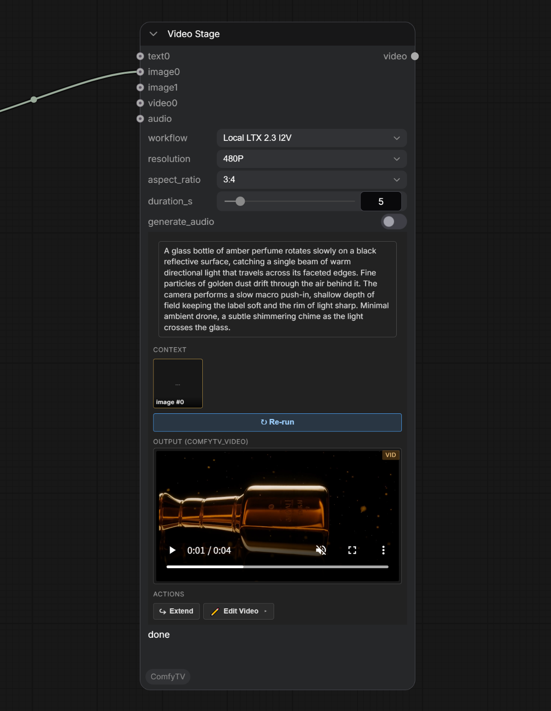
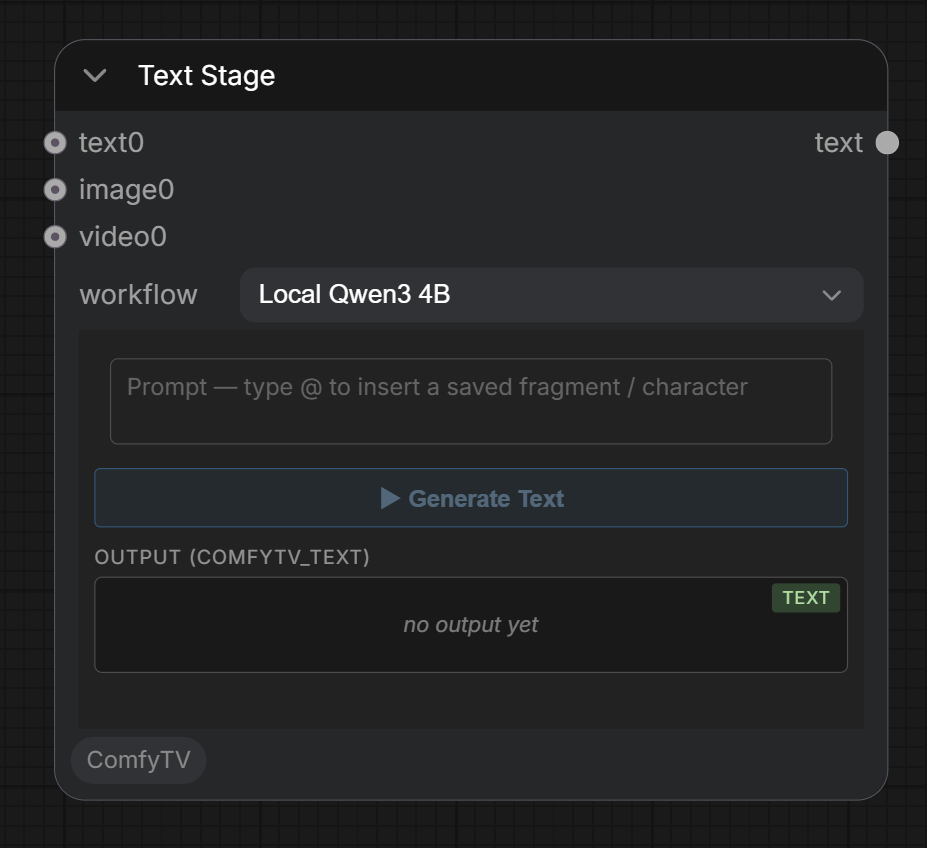
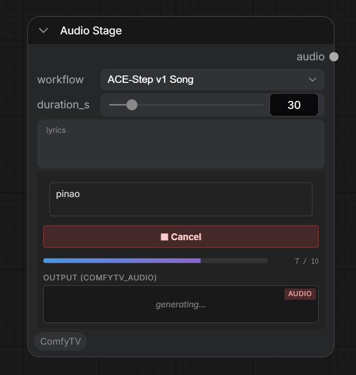
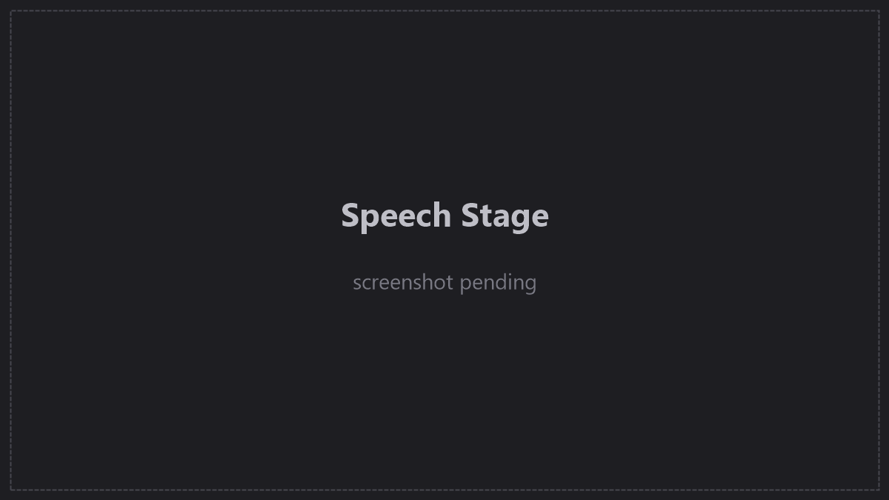
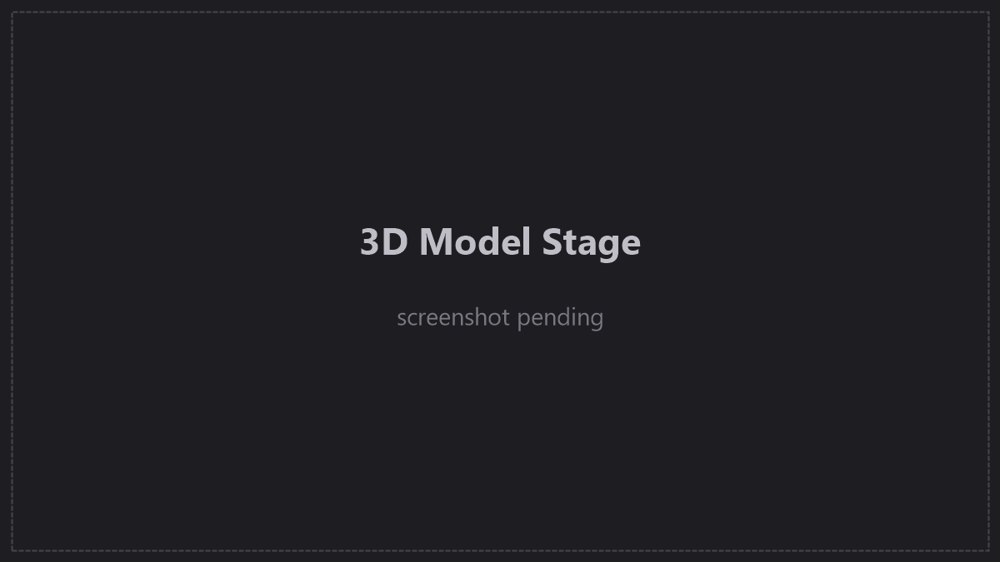

**English** | [简体中文](generate.zh.md)

# Generating content

The **ComfyTV / Generate** group has the stages that create new content from a prompt: Text, Image, Video, Music, Speech, and 3D Model.

Every generator works the same way: type a prompt, pick a **workflow** (model) from the dropdown, click **▶ Run**. The result shows in the node's preview and flows to anything wired downstream.

Under every workflow dropdown sit two buttons:

- **🔗 Link workflow** — *the recommended way to use your own workflow.* Pick one straight from ComfyUI's own workflow library; edit it in ComfyUI and save, and ComfyTV picks up changes automatically. See [custom-workflows.md](custom-workflows.md).
- **⬆ Upload workflow** — import a `.json` file from disk, no restart.

Hover a workflow entry in the stage manager to **★ star it as the default** for that stage kind, and use the **preset bar** on the stage card to save/recall parameter presets.

---

## Image Stage

- **Prompt**: the main text box. Upstream **Text** nodes get appended; upstream **images** feed the current workflow's `LoadImage` (only the i2i workflow consumes them). `@image_N` tokens reference the wired image slots inline.
- **workflow** — shipped: **Local SD1.5** (t2i), **Local SD1.5 I2I** (image-to-image), **Image Ideogram4 T2I** — plus anything you link or upload.
- **resolution / aspect_ratio / batch_size**: target size tier, shape, and how many images per Run.

**Two outputs**: `images` is the whole batch from this Run; `image` is the single thumbnail you picked on the node (defaults to the first one until you click).

### Image-to-image
Pick `Local SD1.5 I2I`, wire a reference image into the **images** slot, write the prompt, Run.

---

## Video Stage

- **workflow** — all four LTX 2.3 variants ship today:
  - `Local LTX 2.3 T2V` — text → video.
  - `Local LTX 2.3 I2V` — image → video.
  - `Local LTX 2.3 FLF2V` — first-last-frame → video. Wire **two** images on **images** (start + end keyframes).
  - `Local LTX 2.3 IA2V` — image + audio → video.
- **resolution / aspect_ratio / duration**: output size, shape, length.
- **audio** input — required for IA2V; the other LTX workflows don't use audio.

Once you have a clip, the whole [video suite](video-and-audio.md) — editing, color, keying, compositing, FX — takes over from there.

---

## Text Stage

Local LLM text generation (built-in **Qwen3 4B**). Use it to expand a prompt, write a description, or feed other stages' context slots.

---

## Music Stage

Text-to-music via **ACE-Step v1 3.5B**:

- **Prompt**: free-form tags — genre, mood, BPM, instrumentation.
- **Lyrics** (optional): empty = instrumental; non-empty = vocal track.
- **Duration**: slider (1–240 s, default 30).

Output is a single FLAC audio file. From there the [audio suite](video-and-audio.md) (EQ, stem split, reverb, …) and the [Music nodes](making-music.md) can pick it up.

---

## Speech Stage

<!-- TODO(screenshot): Speech Stage card with prompt + workflow dropdown -->

Text-to-speech. Ships with a **Kokoro TTS** workflow: type the line to speak, pick a voice in the workflow's parameters, Run. Output is an audio clip — wire it into a Video Stage's `audio` input (IA2V), a Mux Audio node, or the audio suite.

---

## 3D Model Stage

<!-- TODO(screenshot): 3D Model Stage with orbit preview -->

Generates a **3D model (GLB)** via a `model`-kind workflow — link or upload your own (e.g. a Hunyuan3D graph); none ships by default. The node embeds an orbit preview; after you orbit, it auto-captures a screenshot into its image output, so downstream image stages can consume the model's look. The GLB itself flows to the 3D nodes — Scene3D, mesh ops, materials; see the Node Reference.
