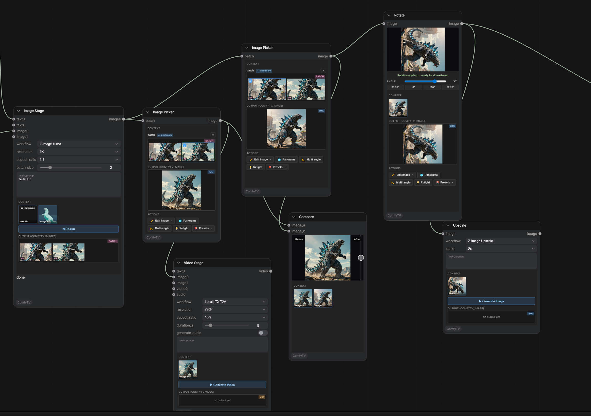
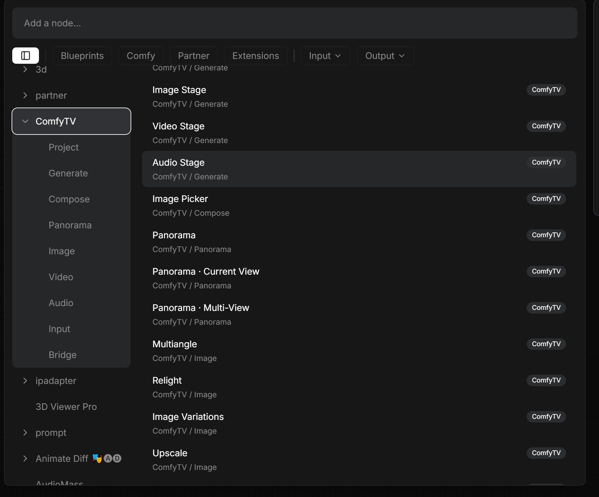
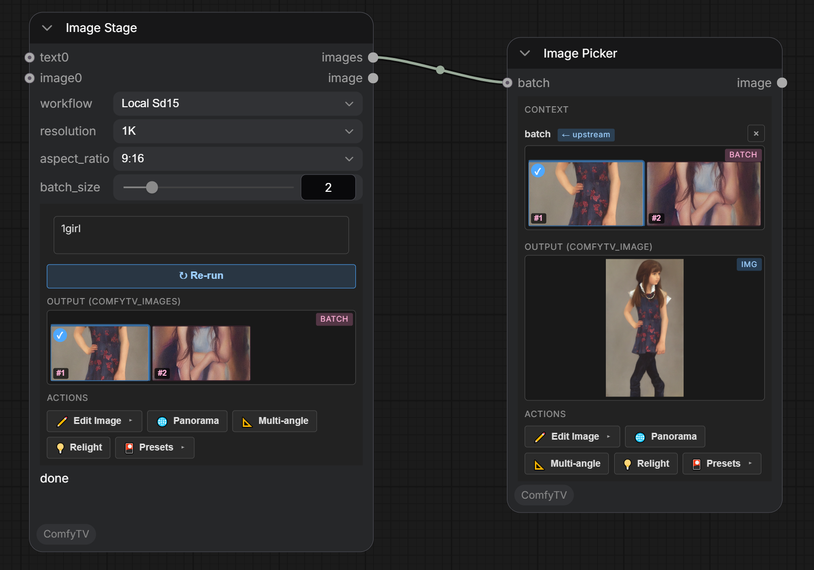
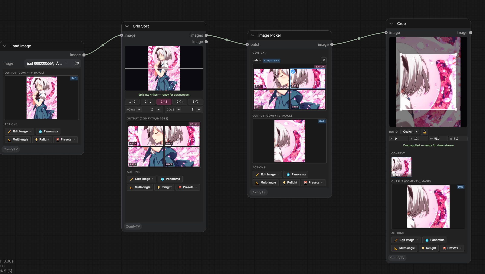

[English](getting-started.md) | **简体中文**

# 入门

ComfyTV 把 ComfyUI 变成一个**类 TapNow / LibTV 型的画布式应用**。每一步操作是一个独立节点,结果自动传播到下游。用 stage 连成完整流程:生成 → 挑选 → 编辑 → 拼接。



---

## 安装

```bash
cd ComfyUI/custom_nodes
git clone https://github.com/jtydhr88/ComfyTV
```

重启 ComfyUI。打开 **Add Node** 菜单(双击画布或右键),找 **`ComfyTV`** 分类。它分成几个子菜单:Project、Input、Generate、Image、Panorama、Video、Audio、Compose。



---

## 基础概念

### 每个节点有自己的运行按钮
大部分 stage 自带一个 **▶ 运行** 按钮。点它**只跑这一个 stage** , **不会**重跑整张图。结果出现在节点自己的输出预览里。

> 有些 stage(Crop、Rotate、Mirror、Grid Split、Panorama 视口) **没有运行按钮** , 它们完全在浏览器里跑,改参数实时更新。

### 结果以快照向下游流动
上游 stage 跑完后,结果存为快照;下游 stage 再跑时直接用这个快照,不会回过头重新跑上游。

### 项目选择器
拖一个 **Project** 节点,给当前项目命名/切换。你生成的所有东西都归入该项目,工作流加载时也会自动恢复。

---

## 简单运行

1. 加一个 **Generate → Image Stage**。
2. 在节点的文本框里输入提示词(比如 `a red apple on a wooden table`)。
3. **workflow** 下拉框里选内置的工作流 **`Local SD1.5`**。
4. 点 **▶ 运行**。



Image Stage 产出**一组图片**(一个工作流可以有多个输出)。**第一次运行时**, ComfyTV **会自动加一个 Image Picker**,接在它的输出后面。

### 选择结果
直接点 Image Stage 上的缩略图,或者点自动生成的 Image Picker 上的缩略图。两种方式都会让选中那帧旁边出现**操作工具栏**(`✏️ Edit`、`🌐 Panorama`、`📐 Multiangle` 等)。



---

## 放大查看预览
鼠标移到任何输出图上,**滚轮**缩放(1×–6×),**拖动**平移,**双击**复位。所有图片输出预览都支持。

---

## 接下来

- [generate.zh.md](generate.zh.md),生成器(文/图/视频/音频)
- [image-tools.zh.md](image-tools.zh.md),裁剪、旋转、Inpaint 以及其它编辑工具
- [compose.zh.md](compose.zh.md),Picker、A/B 对比
