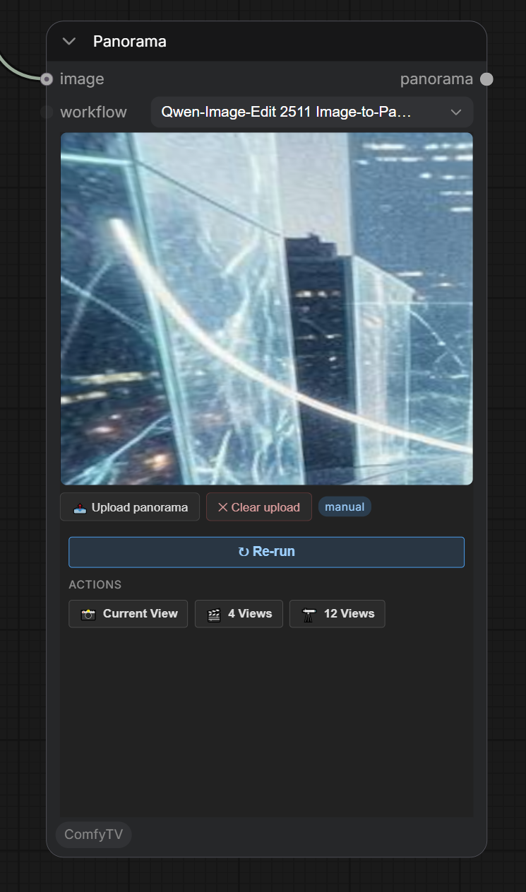
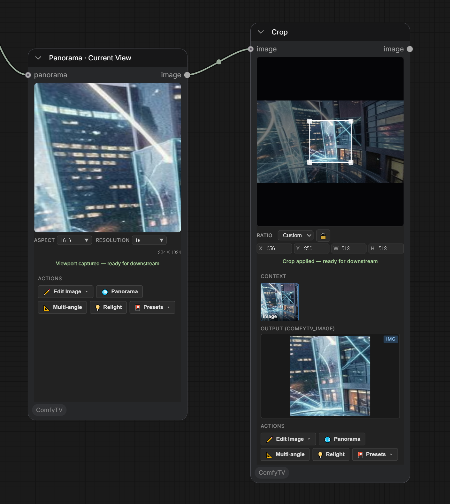
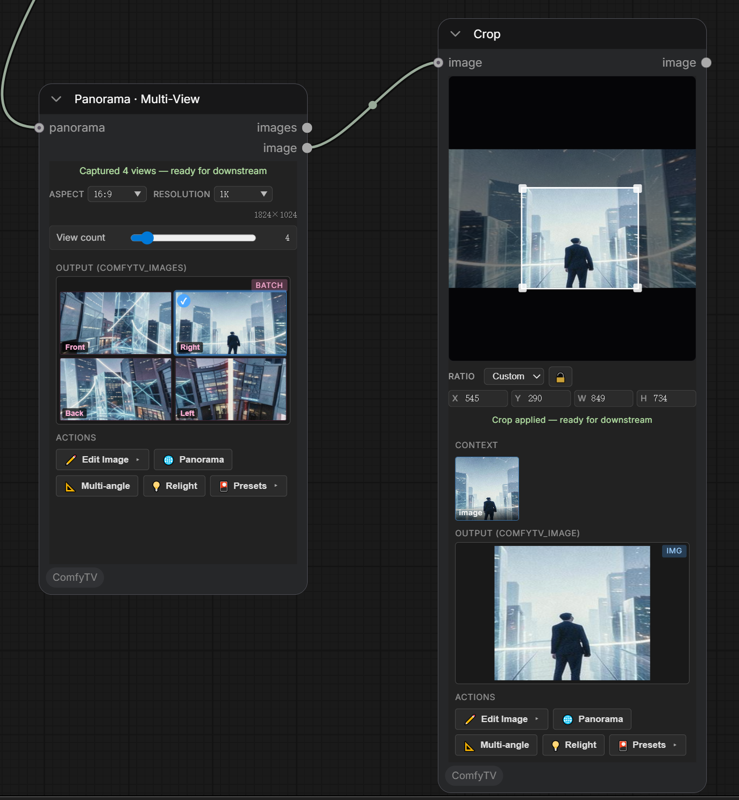

**English** | [简体中文](panorama.zh.md)

# Panorama (360°)

The **ComfyTV / Panorama** group lets you view an equirectangular or HDRI panorama in 3D and extract flat viewport images from it — all in the browser.



---

## Panorama

An interactive 360° viewer. You sit inside the sphere and drag to look around.

### Three ways to get a panorama in
- **Upload** — click **📤 Upload panorama** and choose a file. Supports equirectangular **.jpg / .png / .webp** and HDR **.hdr / .exr**. The viewer loads it immediately and a **manual** badge appears. **Upload wins over everything else** — clear it before using the Run path.
- **Image-to-panorama** — workflow `Qwen-Image-Edit 2511 Image-to-Panorama`. Wire a regular photo into the input; the prompt can add scene-extension guidance ("extend with grasslands and distant mountains"). The source becomes the central front view and Qwen-Edit extrapolates the full 360°.
- **Text-to-panorama** — workflow `Qwen-Image 2512 + 360 LoRA`. No reference image needed; describe the scene in the prompt box and the model generates a full 360° equirectangular from prompt alone. Useful for building environments from scratch.

Uploaded files are stored in ComfyUI's `input` folder. **✕ Clear upload** drops the manual source.

> The Panorama node shows only the 3D viewer, no flat output thumbnail; drag to inspect it in 3D.

---

## Panorama · Current View



Embeds its own panorama viewer. **Drag to aim** at the part of the scene you want; when you release, it **captures** that viewport as a flat image.

- **Aspect** + **Resolution** dropdowns set the captured image's shape and size. The preview shell is locked to the chosen aspect ratio — what you frame is what you get.
- The captured image flows downstream like any other image (wire it into an editor or video stage).

## Panorama · Multi-View



**Captures several evenly-spaced viewports** around the panorama at once → a set of images.

- **View count** slider (2–24) — how many directions to capture.
- **Aspect / Resolution** — per-view shape and size.
- Output is a set of images; wire an **Image Picker**.

When `View count = 4` the views are labelled Front / Right / Back / Left.

---

## Typical flow

```
Image Stage → Image Picker → Panorama (upload or generate)
                                  │
                                  ├── Current View → (edit / video)
                                  └── Multi-View   → Image Picker → (edit)
```
