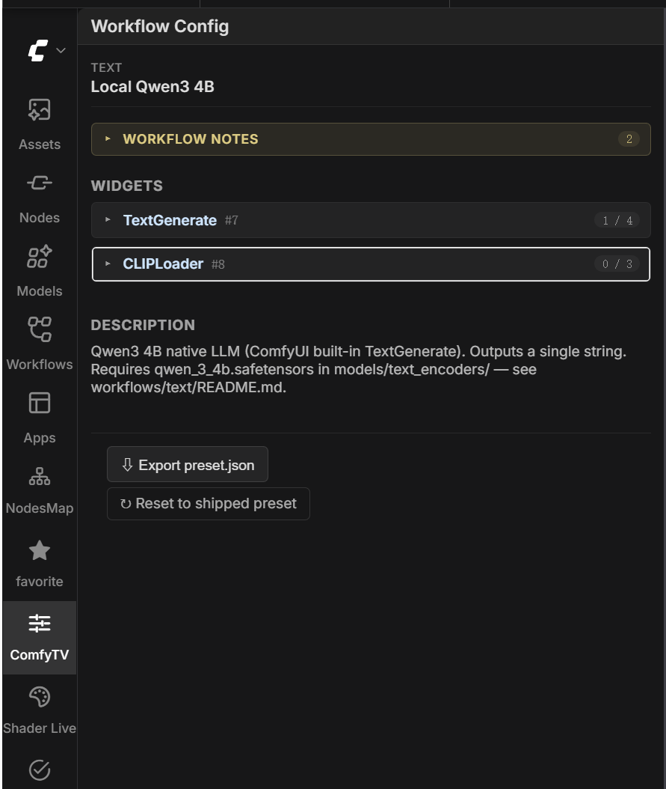
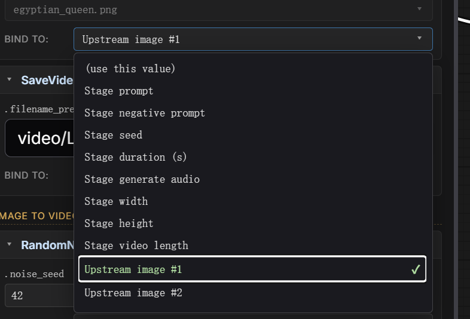

**English** | [简体中文](sidebar-config-editor.zh.md)

# Sidebar config editor

Every ComfyTV stage runs against a **workflow** chosen in its dropdown. The **ComfyTV** sidebar tab lets you inspect and edit how stage inputs map to that workflow's nodes — without touching any files on disk. Changes apply immediately.

> The same surface that ships in `_preset.json` is editable here. The sidebar is meant for end users who want to tweak the shipped defaults.

---

## Opening the editor

1. On the left of the ComfyUI canvas, click the **ComfyTV** tab in the sidebar.
2. Click any ComfyTV stage on the canvas (Image Stage, Inpaint, Upscale, …). The sidebar shows that stage's currently-selected workflow.

The header shows the stage's kind badge and the currently-selected workflow label. If the workflow is being seen for the first time and hasn't been picked by any stage yet, you'll see a hint asking you to select it once on a stage first.

If the workflow contains **Note / MarkdownNote** nodes, their content is collected into a collapsible "Workflow notes" block at the top — that's how workflow authors leave notes for users.

The "Description" section at the bottom shows the preset's `description` field.

> The sidebar stays empty when the selected stage has no `workflow` combo (Crop / Rotate / Mirror transform stages, Load Image / Load Video loader stages). Selecting them shows the empty state.

---

## The widget list

Under the workflow notes you'll see every editable widget in the workflow, grouped by node — each node is a collapsible card. The node header shows the node title, `(node type)`, `#id`, and a `bound / total` count on the right.

Each widget row has three pieces:

- **`.<widget name>`** — e.g. `.seed`, `.text`, `.filename_prefix`.
- **Value editor** — the widget's native input control (number box / text box / dropdown / toggle). Editing here means "replace the workflow's factory value with this constant". When the row is bound to a stage input (the dropdown shows anything other than `(use this value)`), the value editor is greyed out — at run time the value comes from upstream instead.
- **Bind to:** — see the next section.

---

## Binding options (the `Bind to` dropdown)

The dropdown lists the stage's own inputs. The label you see and what it means:

| Label | What runs at execute time |
|---|---|
| **(use this value)** | The constant you typed in the Value editor on this row — e.g. a model filename. |
| **Stage prompt** | The text typed in the stage's main prompt box. |
| **Stage negative prompt** / **Stage seed** / **Stage batch size** / **Stage lyrics** / **Stage scale** / **Stage duration (s)** / **Stage generate audio** / **Stage mask (painter output)** / **Stage pad left/top/right/bottom** / **Stage feathering** / **Stage LLM max output length** | The current value of the corresponding stage widget. Which ones appear depends on the stage type. |
| **Stage width** / **Stage height** / **Stage video length** | Derived from the stage's resolution + aspect ratio + duration. |
| **Upstream image #N** | The N-th image wired into the stage. |
| **Upstream image + painted mask (alpha)** | Inpaint / Erase only. The upstream image with the painter mask baked into its alpha channel — bind a `LoadImage`'s `image` input to this when your workflow takes the mask from the `LoadImage`'s MASK output instead of a separate `LoadImageMask` node. |
| **Upstream video #N** / **Upstream audio #N** / **Upstream text #N** | Same idea for other upstream types. |

For a CheckpointLoader's `ckpt_name`, pick **(use this value)** and type the model filename in the Value editor. For a KSampler's `seed`, pick **Stage seed** — that's all; the runtime generates a fresh random seed each run.

---

## Saving and validation

Editing a value or changing a binding **saves immediately**. The wire-validation indicators on every stage on the canvas re-run after each save; you can see if a change affected upstream sockets right away.

A save that fails shows an inline error.

---

## Editing the workflow itself

The sidebar **only edits bindings**. To change the workflow itself (rename a node, add a step, swap a model loader), open `workflows/<kind>/<name>.json` in ComfyUI's main canvas, edit visually, and save back over the file. The next time a stage picks this workflow, ComfyTV detects the modification-time change and re-reads it — the new structure is immediately usable, no restart needed. Existing bindings keep working as long as the node IDs they reference still exist.

---

## Exporting as a shareable preset

At the bottom of the sidebar there's an **⇩ Export preset.json** button. Click it to download the current bindings + metadata as a JSON file named `<workflow-slug>_preset.json`.

The file you get is the standard `_preset.json` format (see [custom-workflows.md](custom-workflows.md#wiring-stage-inputs)). Typical flow:

1. Drop a workflow JSON into `workflows/<kind>/`.
2. Open it on a stage, prep it, and tweak bindings in the sidebar until you're happy.
3. Click **Export preset.json**.
4. Save the downloaded file next to the workflow JSON, named `<name>_preset.json`.
5. Share the pair (`<name>.json` + `<name>_preset.json`) with someone else. On their first selection of this workflow on a stage, your defaults are auto-applied.

The button is disabled until the workflow has been picked on a stage at least once.

---

## Reset to the shipped preset

Next to **Export preset.json** at the bottom of the sidebar there's a **↻ Reset to shipped preset** button. Clicking it wipes all bindings + metadata for the current workflow and re-reads the on-disk `_preset.json` once. Any edits you made are lost.

If the workflow has no `_preset.json` file, the button errors with `no shipped preset for this workflow`.

---

## See also

- [custom-workflows.md](custom-workflows.md) — how to ship your own workflow + `_preset.json`
- Per-kind READMEs under `workflows/<kind>/README.md` — the run-time contract for each stage kind (what stage inputs exist, what nodes the workflow needs)
