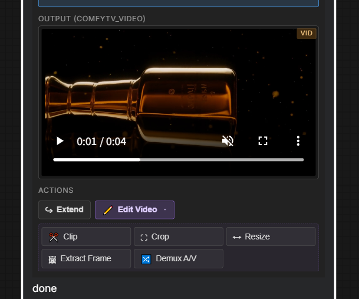

[English](video-and-audio.md) | **简体中文**

# 视频和音频

> 视频**生成**在 Generate 分组里(见 [generate.zh.md](generate.zh.md))。本页讲 **ComfyTV / Video** 里的**编辑** stage 和 **ComfyTV / Audio** 里的分离 stage。Video Upscale、Subtitle Erase、Demucs 人声/伴奏分离 待支持,见 [roadmap.zh.md](roadmap.zh.md)。

---

## 视频编辑(ComfyTV / Video)

把一个视频(来自 **Generate → Video** stage 或 **Load Video** 节点)接到这些其中任意一个:

| Stage | 干啥 | 状态 |
|---|---|---|
| **Video Clip** | 剪到一段起止时间范围。 | ✅ PyAV |
| **Video Crop** | 裁剪一个矩形区域。 | ✅ PyAV |
| **Video Resize** | 改尺寸(宽 / 高),帧率不变。 | ✅ PyAV |
| **Video Extract Frame** | 抽出一帧静态图(首/末帧 / 指定时间点)。输出是 `COMFYTV_IMAGE`。 | ✅ PyAV |
| **↪ Extend**(工具栏动作) | 一键链 , 抽源片末帧,生成一个新的 Video Stage,把那帧接为 I2V 起始图。 | ✅ |
| **Video Upscale** | 逐帧放大。 | ⏳ 待支持 |
| **Subtitle Erase (Smart)** | 自动识别并去除内嵌字幕。 | ⏳ 待支持 |
| **Subtitle Erase (Region)** | 在你框选的区域内去字幕。 | ⏳ 待支持 |

---

## 音频(ComfyTV / Audio)

拿一段视频或音轨,拆分:

| Stage | 输出 | 状态 |
|-------|--------|------|
| **Demux · Audio Track** | 从视频里提取出的音轨。 | ✅ PyAV |
| **Demux · Silent Video** | 抽掉音轨的视频。 | ✅ PyAV |
| **Audio · Vocals Only** | 分离出来的人声(Demucs)。 | ⏳ 待支持 |
| **Audio · Background Only** | 伴奏 / 环境音(Demucs)。 | ⏳ 待支持 |

demux 一对节点用同一段源视频:一个抽音轨,一个出无声视频。工具栏的 🔀 **Demux** 一键同时生成两个。

分离/提取出来的音轨可以接到 **Video Stage** 的可选 `audio` 输入做音频驱动视频生成(可以配 LTX 2.3 IA2V)。
